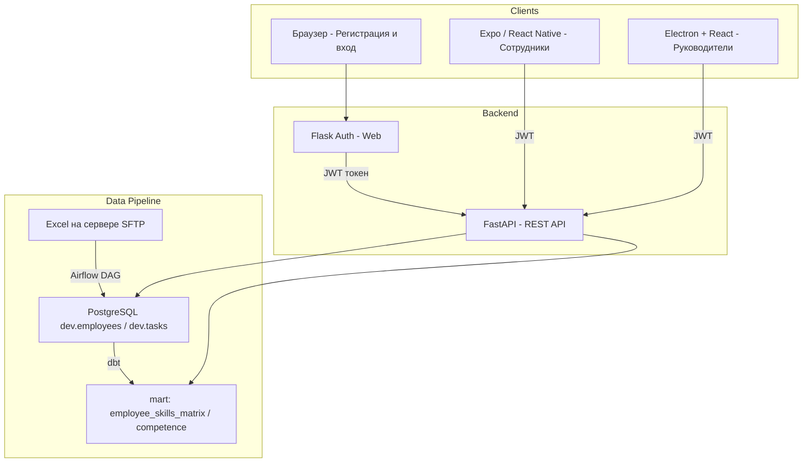
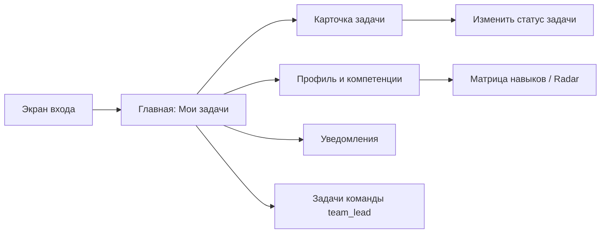
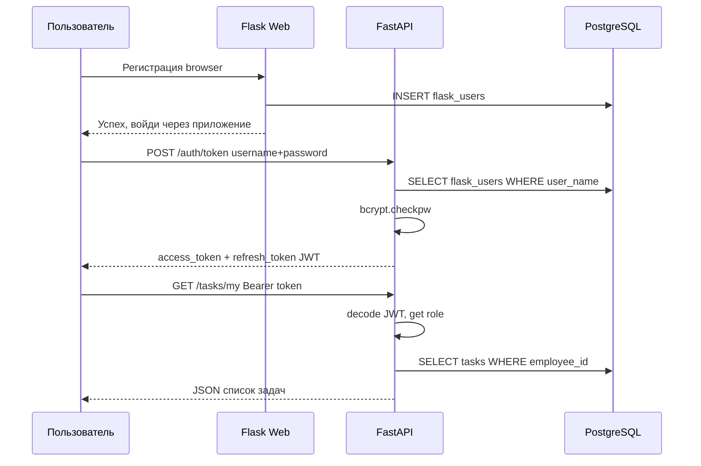

# Архитектура: Программный комплекс управления задачами с профилем компетенций сотрудника

## 1. Обзор системы

Система состоит из **4 слоёв**:

| Слой | Технология | Назначение |
|------|-----------|------------|
| Веб (регистрация/вход) | Flask (существующий) | Регистрация, авторизация, выдача JWT |
| API | **FastAPI** (новый) | REST API для мобильного клиента и десктопа |
| Мобильное приложение | **Expo / React Native** | Сотрудники: задачи, компетенции, профиль |
| Десктоп-дашборд | **Electron + React** | Руководители: загруженность, аналитика, управление |

Существующий пайплайн (Airflow → dbt → PostgreSQL) остаётся как есть и продолжает питать данными всю систему.

---

## 2. Общая архитектура системы



---

## 3. Роли пользователей

| Роль | Платформа | Права |
|------|----------|-------|
| **employee** | Expo мобильное | Просмотр своего профиля, компетенций, задач |
| **team_lead** | Expo / Electron | Просмотр задач команды, назначение сотрудников |
| **manager** | Electron десктоп | Полный дашборд загруженности, управление задачами |
| **hr** | Electron десктоп | Управление компетенциями и профилями сотрудников |
| **admin** | Веб / Electron | Полный доступ, управление пользователями |

---

## 4. Схема базы данных (новые таблицы)

Существующие таблицы сохраняются. Добавляются:

```sql
-- Роли пользователей
CREATE TABLE dev.roles (
    id SERIAL PRIMARY KEY,
    name VARCHAR(50) UNIQUE NOT NULL  -- employee, team_lead, manager, hr, admin
);

-- Расширение flask_users
ALTER TABLE dev.flask_users ADD COLUMN role_id INTEGER REFERENCES dev.roles(id);
ALTER TABLE dev.flask_users ADD COLUMN is_active BOOLEAN DEFAULT TRUE;
ALTER TABLE dev.flask_users ADD COLUMN last_login TIMESTAMP;

-- Статусы и приоритеты задач (вместо просто deadline)
CREATE TABLE dev.task_status (
    id SERIAL PRIMARY KEY,
    task_id VARCHAR(50) REFERENCES dev.tasks(task_id),
    status VARCHAR(30) DEFAULT 'new', -- new, in_progress, done, blocked
    priority INTEGER DEFAULT 3,        -- 1=high, 2=medium, 3=low
    assigned_employee_id VARCHAR(50),
    assigned_at TIMESTAMP,
    completed_at TIMESTAMP,
    notes TEXT,
    updated_by VARCHAR(100),
    updated_at TIMESTAMP DEFAULT NOW()
);

-- Уровни компетенций (grade)
CREATE TABLE dev.employee_competency_level (
    id SERIAL PRIMARY KEY,
    employee_id VARCHAR(50),
    competency VARCHAR(100),
    level INTEGER DEFAULT 1,           -- 1=Junior, 2=Middle, 3=Senior, 4=Expert
    confirmed_by VARCHAR(100),
    confirmed_at TIMESTAMP,
    updated_at TIMESTAMP DEFAULT NOW()
);

-- Push-уведомления токены
CREATE TABLE dev.push_tokens (
    id SERIAL PRIMARY KEY,
    user_name VARCHAR(100) REFERENCES dev.flask_users(user_name),
    expo_push_token TEXT,
    device_platform VARCHAR(20),       -- ios, android
    updated_at TIMESTAMP DEFAULT NOW()
);

-- Уведомления
CREATE TABLE dev.notifications (
    id SERIAL PRIMARY KEY,
    recipient_employee_id VARCHAR(50),
    title VARCHAR(200),
    body TEXT,
    is_read BOOLEAN DEFAULT FALSE,
    created_at TIMESTAMP DEFAULT NOW()
);
```

---

## 5. FastAPI — структура и эндпоинты

### Структура проекта

```
fastapi_app/
├── main.py                  # Точка входа, подключение роутеров
├── config.py                # Конфигурация (DB, JWT secret)
├── database.py              # SQLAlchemy async engine
├── models/
│   ├── user.py
│   ├── task.py
│   ├── employee.py
│   └── notification.py
├── schemas/                 # Pydantic схемы
│   ├── user.py
│   ├── task.py
│   ├── employee.py
│   └── notification.py
├── routers/
│   ├── auth.py              # POST /auth/token (получение JWT)
│   ├── tasks.py             # CRUD задач
│   ├── employees.py         # Профили и компетенции
│   ├── dashboard.py         # Агрегированные данные для руководителей
│   └── notifications.py     # Уведомления и push-токены
├── dependencies/
│   └── auth.py              # get_current_user, require_role()
└── Dockerfile
```

### Ключевые API-эндпоинты

#### Аутентификация
| Метод | URL | Описание |
|-------|-----|----------|
| POST | `/auth/token` | Получить JWT по логину/паролю |
| POST | `/auth/refresh` | Обновить токен |
| GET  | `/auth/me` | Текущий пользователь |

#### Сотрудники
| Метод | URL | Описание |
|-------|-----|----------|
| GET  | `/employees/me` | Мой профиль + компетенции |
| GET  | `/employees/{id}` | Профиль сотрудника (manager+) |
| GET  | `/employees/` | Список сотрудников (manager+) |
| PUT  | `/employees/{id}/competencies` | Обновить компетенции (hr+) |
| GET  | `/employees/{id}/tasks` | Задачи сотрудника |

#### Задачи
| Метод | URL | Описание |
|-------|-----|----------|
| GET  | `/tasks/my` | Мои задачи |
| GET  | `/tasks/` | Все задачи (manager+) |
| POST | `/tasks/` | Создать задачу (manager+) |
| PUT  | `/tasks/{id}` | Редактировать задачу |
| PUT  | `/tasks/{id}/status` | Изменить статус |
| DELETE | `/tasks/{id}` | Удалить задачу (admin) |
| GET  | `/tasks/by-department/{dept}` | Задачи по отделу |

#### Дашборд (руководители)
| Метод | URL | Описание |
|-------|-----|----------|
| GET  | `/dashboard/workload` | Загруженность по сотрудникам |
| GET  | `/dashboard/departments` | Статистика по отделам |
| GET  | `/dashboard/skills-gap` | Несоответствие компетенций |
| GET  | `/dashboard/vacations` | Плановые отпуска + риски |

#### Уведомления
| Метод | URL | Описание |
|-------|-----|----------|
| GET  | `/notifications/` | Мои уведомления |
| PUT  | `/notifications/{id}/read` | Отметить прочитанным |
| POST | `/notifications/push-token` | Зарегистрировать Expo push-token |

---

## 6. Мобильное приложение Expo (React Native)

### Целевая аудитория: сотрудники, тимлиды

### Структура проекта

```
mobile-app/
├── app/                         # Expo Router файловая маршрутизация
│   ├── (auth)/
│   │   └── login.tsx            # Экран входа (ссылка на веб-регистрацию)
│   ├── (tabs)/
│   │   ├── _layout.tsx          # Tab-навигация
│   │   ├── index.tsx            # Главный экран: мои задачи
│   │   ├── profile.tsx          # Мой профиль + компетенции
│   │   └── notifications.tsx    # Уведомления
│   └── tasks/
│       ├── [id].tsx             # Детальная карточка задачи
│       └── team.tsx             # Задачи команды (team_lead)
├── components/
│   ├── TaskCard.tsx             # Карточка задачи
│   ├── CompetencyBadge.tsx      # Бейдж компетенции с уровнем
│   ├── WorkloadBar.tsx          # Индикатор загруженности
│   └── SkillMatrix.tsx          # Матрица навыков (radar chart)
├── hooks/
│   ├── useAuth.ts               # JWT, хранение в SecureStore
│   ├── useTasks.ts              # Запросы к /tasks
│   └── useEmployee.ts           # Запросы к /employees
├── store/
│   └── authStore.ts             # Zustand: текущий пользователь + токен
├── services/
│   └── api.ts                   # Axios instance с JWT interceptor
└── constants/
    └── colors.ts
```

### Экраны мобильного приложения



### Ключевые UI-компоненты

- **TaskCard** — статус цветом, приоритет, дедлайн, исполнитель
- **SkillMatrix** — radar chart компетенций сотрудника с уровнями
- **CompetencyBadge** — бейджик с уровнем Junior/Middle/Senior/Expert
- **WorkloadBar** — прогресс-бар загруженности для team_lead
- **Push-уведомления** — через Expo Notifications при назначении задачи

---

## 7. Десктоп-приложение Electron + React

### Целевая аудитория: менеджеры, HR, руководители

### Структура проекта

```
desktop-app/
├── electron/
│   ├── main.js              # Главный процесс Electron
│   └── preload.js           # Безопасный bridge renderer ↔ main
├── src/
│   ├── App.tsx
│   ├── pages/
│   │   ├── Login.tsx         # Форма входа (JWT)
│   │   ├── Dashboard.tsx     # Главная: загруженность ресурсов
│   │   ├── Tasks.tsx         # Реестр задач с фильтрами
│   │   ├── TaskCreate.tsx    # Создание задачи с подбором исполнителя
│   │   ├── Employees.tsx     # Список сотрудников
│   │   ├── EmployeeDetail.tsx# Профиль + матрица компетенций
│   │   ├── SkillsGap.tsx     # Анализ несоответствия компетенций
│   │   └── Vacations.tsx     # Плановые отпуска и риски
│   ├── components/
│   │   ├── WorkloadHeatmap.tsx  # Тепловая карта загруженности
│   │   ├── DeptChart.tsx        # График по отделам
│   │   ├── SkillsRadar.tsx      # Radar chart компетенций
│   │   ├── TaskTable.tsx        # Таблица задач с сортировкой
│   │   └── AssignmentSuggest.tsx# Авто-подбор исполнителя по компетенциям
│   ├── store/
│   │   └── appStore.ts          # Zustand: фильтры, пользователь
│   └── services/
│       └── api.ts               # Axios instance
├── package.json
└── vite.config.ts
```

### Ключевые функции десктопа

- **Тепловая карта загруженности** — по дням/неделям, кто перегружен
- **Реестр задач** — фильтр по отделу, статусу, приоритету, дедлайну
- **Подбор исполнителя** — система предлагает сотрудников, чьи компетенции совпадают с `required_competency` задачи
- **Анализ skills-gap** — какие компетенции требуются по задачам, а каких нет у команды
- **Риски отпусков** — наложение дедлайнов задач на `planned_vacation_date`

---

## 8. Процесс аутентификации (полный поток)



---

## 9. Что нужно добавить / дописать

### Критичные (MVP)
- [ ] **FastAPI** — новый сервис (`fastapi_app/`) со всеми эндпоинтами
- [ ] **Расширение БД** — добавить `task_status`, `employee_competency_level`, `roles`, push_tokens, notifications
- [ ] **Роли в flask_users** — добавить `role_id` к существующей таблице
- [ ] **Expo мобильное приложение** — базовые экраны: задачи, профиль, уведомления
- [ ] **Electron десктоп** — дашборд загруженности + реестр задач + управление

### Важные (Post-MVP)
- [ ] **Push-уведомления** через Expo Notifications API (при назначении задачи)
- [ ] **Автоподбор исполнителя** — алгоритм по компетенциям из `employee_skills_matrix`
- [ ] **Skills-gap анализ** — сравнение required_competency задач с employee competencies
- [ ] **Offline-режим** в мобильном (React Query + кэш для просмотра без интернета)

### Технический долг
- [ ] Перевести Flask auth на выдачу JWT вместо редиректа в Superset
- [ ] Superset оставить только для внутреннего BI, не для пользователей
- [ ] Добавить миграции БД (Alembic)
- [ ] Контейнеризировать FastAPI в docker-compose.yaml

---

## 10. Обновлённый docker-compose (добавления)

```yaml
# Добавить в docker-compose.yaml:
  fastapi:
    container_name: fastapi_container
    build: ./fastapi_app
    ports:
      - "8001:8001"
    environment:
      DATABASE_URL: postgresql+asyncpg://db_user:db_password@db:5432/db
      JWT_SECRET: your-secret-key
    depends_on:
      - db
    networks:
      - my-network
```

---

## 11. Стек технологий (итог)

| Компонент | Технология | Статус |
|-----------|-----------|--------|
| БД | PostgreSQL 15 | ✅ Существует |
| Пайплайн данных | Airflow + dbt | ✅ Существует |
| Авторизация (веб) | Flask + bcrypt + JWT | ✅ Существует |
| API | **FastAPI + SQLAlchemy async + Pydantic v2** | 🆕 Новый |
| Мобильное приложение | **Expo SDK 51 + React Native** | 🆕 Новый |
| Состояние (mobile) | **Zustand + React Query** | 🆕 Новый |
| Десктоп | **Electron 30 + React + Vite** | 🆕 Новый |
| Графики | **Victory Native (mobile) + Recharts (desktop)** | 🆕 Новый |
| Push-уведомления | **Expo Notifications** | 🆕 Новый |
| Миграции БД | **Alembic** | 🆕 Новый |
| BI-дашборд (внутренний) | Superset | ✅ Остаётся |
