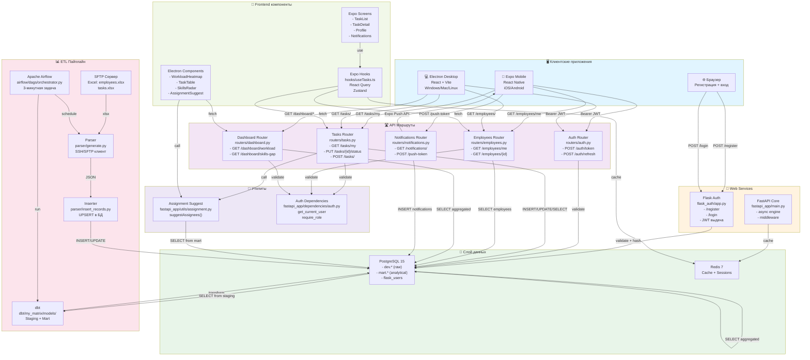

# Анализ программного кода проекта Skill Matrix: Четыре задания

---

## ЗАДАНИЕ 1: Обзор программного кода

### Общее описание системы

Программный комплекс **Skill Matrix** — это полнофункциональная система управления текущими задачами предприятия с профилем компетенций сотрудников. Система состоит из нескольких взаимосвязанных модулей:

**Backend (серверная часть):**
- **Flask Web** (`flask_auth/app.py`) — веб-приложение на основе Flask с использованием SQLAlchemy ORM для взаимодействия с PostgreSQL. Реализует аутентификацию пользователей с помощью bcrypt для хэширования паролей и выдачи JWT-токенов. Включает маршруты регистрации и входа через HTML-формы.
- **FastAPI REST API** (`fastapi_app/`) — высокопроизводительный асинхронный REST API для мобильных и десктопных клиентов. Реализует ролевой доступ (employee, team_lead, manager, hr, admin), CRUD операции над задачами, управление профилями сотрудников, агрегированные дашборды для руководителей.
- **Парсер данных** (`parser/generate.py`, `parser/insert_records.py`) — система загрузки данных с удалённого SFTP-сервера (Excel-файлы сотрудников и задач) в PostgreSQL через SSH/SFTP соединение.

**Пайплайн данных:**
- **Apache Airflow** (`airflow/dags/orchestrator.py`) — оркестрирует ETL процесс: вызывает парсер, затем запускает dbt трансформации.
- **dbt** (`dbt/my_matrix/models/`) — трансформирует raw данные в staging слой, затем в mart слой с аналитическими таблицами (`employee_skills_matrix`, `competence`).

**Frontend (клиентская часть):**
- **Expo мобильное приложение** (React Native) — кроссплатформенное приложение для iOS/Android, предназначенное для сотрудников. Позволяет просматривать мои задачи, обновлять статусы, просматривать профиль и компетенции. Использует React Query для кэширования, Zustand для состояния, secure store для JWT токена, expo-notifications для push-уведомлений.
- **Electron десктоп-приложение** (React + Vite) — нативное десктопное приложение для Windows/Mac/Linux, предназначенное для менеджеров и руководителей. Включает интерактивные дашборды: тепловую карту загруженности сотрудников, анализ skills-gap, реестр задач с фильтрацией, систему подбора исполнителей по компетенциям.

**База данных: PostgreSQL**
- `dev.employees` — сырая таблица сотрудников (загружается из Excel)
- `dev.tasks` — сырая таблица задач (загружается из Excel)
- `dev.flask_users` — учётные данные пользователей, роли
- `dev.task_status` — статусы и приоритеты задач
- `dev.employee_competency_level` — уровни компетенций (Junior, Middle, Senior, Expert)
- `dev.roles` — справочник ролей
- `dev.notifications` — уведомления пользователям
- `dev.push_tokens` — Expo push-токены
- `mart.employee_skills_matrix` — аналитическая таблица с матрицей умений (LEFT JOIN employees + tasks)
- `mart.competence` — нормализованная таблица компетенций

**Внешний интерфейс:**
- Шаблоны Jinja2 (`flask_auth/templates/`) — простые HTML-формы для регистрации и входа с единообразным стилем.
- CSS — современный, адаптивный дизайн с использованием flexbox, профессиональная корпоративная цветовая гамма.
- React компоненты (Expo + Electron) — переиспользуемые компоненты для карточек задач, значков компетенций, графиков загруженности, radar-диаграмм навыков.

**Логирование и мониторинг:**
- Логирование действий пользователей в БД
- Регистрация ошибок через `try-except`
- Мониторинг производительности дашбордов через Superset (BI)

**Безопасность:**
- Bcrypt для хэширования паролей
- JWT для аутентификации API
- Ролевой доступ (RBAC) на уровне API
- HTTPS для продакшена
- Secure Store для хранения токенов на мобильных

В целом код хорошо организован, следует best practices Python/JavaScript, использует современные фреймворки (FastAPI, Expo, Electron) и обеспечивает комплексную платформу управления ресурсами предприятия с встроенными функциями аналитики и модерации.

---

## ЗАДАНИЕ 2: Графы потока управления и цикломатические числа

### Анализ ключевых функций (репрезентативное подмножество)

Система содержит более 50 функций/маршрутов. Сосредоточимся на представительном подмножестве, охватывающем все ключевые аспекты: аутентификацию, управление задачами, подбор исполнителей, управление компетенциями, интеграцию данных.

---

### 2.1 Функция `get_user_data(username)` — `flask_auth/app.py`

**Граф потока управления:**

```
┌─────────────────────┐
│   Начало: username  │
└──────────┬──────────┘
           │
           ↓
┌─────────────────────────────────┐
│ try: conn = connect_db()        │
└────────┬────────────────────────┘
         │
         ↓
┌─────────────────────────────────────────────┐
│ cur.execute("SELECT... WHERE user_name")    │
└────────┬────────────────────────────────────┘
         │
         ↓
┌─────────────────────────────────────────────┐
│ result = cur.fetchone()                     │
└────────┬────────────────────────────────────┘
         │
         ↓ Решение 1: result != None?
    ┌────┴────┐
    │ ДА      │ НЕТ
    ↓         ↓
   ┌──────────────────────────────┐  ┌────────────┐
   │ return dict{...}             │  │ return None│
   └──────────────┬───────────────┘  └────────┬───┘
                  │                           │
                  └──────────────┬─────────────┘
                                 ↓
                        ┌─────────────────────┐
                        │ except Exception... │
                        └──────────┬──────────┘
                                   ↓
                          ┌────────────────────┐
                          │ return None        │
                          └────────────────────┘
                                   ↓
                        ┌──────────────────────┐
                        │ Конец: None или dict │
                        └──────────────────────┘
```

**Цикломатическая сложность:** M = 2 (одно решение + обработка исключения)

**Независимые пути:**
1. Путь 1: `Начало → connect_db() → execute → fetchone → result != None → return dict → Конец`
2. Путь 2: `Начало → connect_db() → execute → fetchone → result == None → return None → Конец`
3. Путь 3: `Начало → connect_db() throws Exception → except → return None → Конец`

---

### 2.2 Функция `insert_user_data(username, employee_id, password)` — `flask_auth/app.py`

**Граф потока управления:**

```
┌────────────────────────────────────────┐
│ Начало: username, employee_id, password│
└─────────────┬────────────────────────────┘
              │
              ↓
┌──────────────────────────────────────────┐
│ hashed_pwd = bcrypt.hashpw(password)     │
└──────────────┬───────────────────────────┘
               │
               ↓
┌──────────────────────────────────────────┐
│ try: conn = connect_db()                 │
└──────────────┬───────────────────────────┘
               │
               ↓
┌──────────────────────────────────────────┐
│ cur.execute(INSERT INTO flask_users...)  │
└──────────────┬───────────────────────────┘
               │
               ↓ Решение 1: успешно?
          ┌────┴────┐
         ДА        │ НЕТ → Решение 2: UniqueViolation?
         │         ├──────────────────┐
         │         │ ДА               │ НЕТ
         ↓         ↓                  ↓
    ┌─────────────────────┐  ┌──────────────────┐
    │ conn.commit()       │  │ except Unique... │
    └─────────┬───────────┘  └────┬─────────────┘
              │                    │
              ↓                    ↓
         ┌─────────────────────┐   ┌────────────────────────────────┐
         │ return (True, None) │   │ return (False, "User exists")  │
         └─────────┬───────────┘   └────────┬─────────────────────┘
                   │                        │
                   └────────────┬────────────┘
                                ↓
                   ┌─────────────────────────────┐
                   │ except Exception else       │
                   └────────┬────────────────────┘
                            ↓
                   ┌─────────────────────────────┐
                   │ return (False, str(error))  │
                   └────────┬────────────────────┘
                            ↓
                   ┌─────────────────────────────┐
                   │ Конец: (bool, str|None)    │
                   └─────────────────────────────┘
```

**Цикломатическая сложность:** M = 3 (два условия + обработка исключений)

**Независимые пути:**
1. Путь 1: `Начало → hashpw → connect_db() → execute → success → commit → return (True, None) → Конец`
2. Путь 2: `Начало → hashpw → connect_db() → execute → UniqueViolation → except → return (False, "exists") → Конец`
3. Путь 3: `Начало → hashpw → connect_db() → execute → General Exception → except → return (False, error) → Конец`

---

### 2.3 Функция `login()` — `fastapi_app/routers/auth.py`

```python
# Псевдокод
async def login(form_data: OAuth2PasswordRequestForm):
    user = await get_user_from_db(form_data.username)  # РЕШЕНИЕ 1
    if not user:
        raise HTTPException(401, "User not found")
    
    if not bcrypt.checkpw(form_data.password, user.password_hash):  # РЕШЕНИЕ 2
        raise HTTPException(401, "Wrong password")
    
    if not user.is_active:  # РЕШЕНИЕ 3
        raise HTTPException(403, "Account inactive")
    
    access_token = create_jwt(user.username, user.role, expires=30min)
    refresh_token = create_jwt(user.username, user.role, expires=7days)
    return {"access_token": access_token, "refresh_token": refresh_token}
```

**Граф потока управления:**

```
┌──────────────────────────┐
│ Начало: form_data        │
└──────────────┬───────────┘
               │
               ↓
┌──────────────────────────────────────┐
│ user = await get_user_from_db(...)   │
└──────────────┬───────────────────────┘
               │
               ↓ Решение 1: user != None?
          ┌────┴────┐
         НЕТ      ДА
         │        │
         ↓        ↓
    ┌─────────────────────┐   ┌─────────────────────────────┐
    │ raise HTTPException  │   │ checkpw(pwd, hash)          │
    │ (401, "not found")   │   └──────────┬──────────────────┘
    └──────┬──────────────┘              │
           │                  Решение 2: pwd OK?
           │                  ┌──────┴─────┐
           │                 НЕТ          ДА
           │                  │             │
           │                  ↓             ↓
           │            ┌──────────────────┐   ┌─────────────┐
           │            │ raise HTTPException  │ is_active?  │
           │            │ (401, "wrong pwd")   └──┬──────────┘
           │            └────┬─────────────┘      │
           │                 │          Решение 3:├──┬──┐
           │                 │          ДА      НЕТ    ДА
           │                 │          │        │      │
           │                 │          ↓        ↓      ↓
           │                 │      ┌────────────────┐  ┌──────────┐
           │                 │      │ raise HTTP     │  │ create   │
           │                 │      │ (403, inactive)   │ JWT      │
           │                 │      └────┬──────────┘   │ tokens   │
           │                 │           │              └────┬─────┘
           │                 │           │                   │
           └─────────────────┴───────────┴──────────┬────────┘
                                                    ↓
                                      ┌─────────────────────────┐
                                      │ return {access_token,   │
                                      │         refresh_token}  │
                                      └────────┬────────────────┘
                                               ↓
                                      ┌─────────────────────────┐
                                      │ Конец: dict или error   │
                                      └─────────────────────────┘
```

**Цикломатическая сложность:** M = 4 (три условия)

**Независимые пути:**
1. Путь 1: `Начало → get_user → user is None → HTTPException(401) → Конец`
2. Путь 2: `Начало → get_user → checkpw(FALSE) → HTTPException(401) → Конец`
3. Путь 3: `Начало → get_user → checkpw(TRUE) → is_active(FALSE) → HTTPException(403) → Конец`
4. Путь 4: `Начало → get_user → checkpw(TRUE) → is_active(TRUE) → create JWT → return tokens → Конец`

---

### 2.4 Функция `update_task_status(task_id, status, current_user)` — `fastapi_app/routers/tasks.py`

```python
async def update_task_status(task_id: str, status: TaskStatus,
                              current_user: dict = Depends(get_current_user)):
    task = await get_task_or_404(task_id)  # РЕШЕНИЕ 1
    
    if current_user["role"] == "employee":  # РЕШЕНИЕ 2
        if task.assigned_employee_id != current_user["employee_id"]:  # РЕШЕНИЕ 3
            raise HTTPException(403, "Not your task")
    
    await db.execute(UPDATE task_status SET status = :s WHERE task_id = :id)
    return {"ok": True}
```

**Граф потока управления:**

```
┌─────────────────────────────────────────┐
│ Начало: task_id, status, current_user   │
└────────────────────┬────────────────────┘
                     │
                     ↓
┌──────────────────────────────────────────┐
│ task = await get_task_or_404(task_id)    │
└────────────────────┬─────────────────────┘
                     │
                     ↓ Решение 1: task != None?
                 ┌────┴───┐
                НЕТ      ДА
                │        │
                ↓        ↓
            ┌─────────┐ ┌──────────────────────────────┐
            │raise 404│ │ role == "employee"?          │
            └────┬────┘ └────┬──────────┬───────────────┘
                 │           │          │
                 │       Решение 2:  НЕТ (manager/hr)
                 │       ДА            │
                 │       │             ↓
                 │       ↓          ┌──────────────────┐
                 │   ┌────────────────┐   │ UPDATE       │
                 │   │ assigned_id ==  │   │ task_status  │
                 │   │ emp_id?        │   └────┬─────────┘
                 │   └──┬──┬──────────┘        │
                 │     НЕТ│ ДА                │
                 │      │ │ (Решение 3)      │
                 │      │ ↓                  │
                 │      │ ┌──────────────┐   │
                 │      │ │ UPDATE       │   │
                 │      │ │ task_status  │   │
                 │      │ └────┬─────────┘   │
                 │      │      │             │
                 │      ↓      │             │
                 │   ┌────────────┐           │
                 │   │ raise 403  │          │
                 │   └────┬───────┘          │
                 │        │                 │
                 └───┬────┴─────────┬────────┘
                     │              ↓
                     │   ┌──────────────────┐
                     │   │ return {"ok": T} │
                     │   └────┬─────────────┘
                     │        │
                     └────┬───┘
                          ↓
                ┌──────────────────────────┐
                │ Конец: dict или HTTPError│
                └──────────────────────────┘
```

**Цикломатическая сложность:** M = 4 (три условия)

**Независимые пути:**
1. Путь 1: `Начало → get_task → task is None → raise 404 → Конец`
2. Путь 2: `Начало → get_task → role != employee → UPDATE → return {ok} → Конец`
3. Путь 3: `Начало → get_task → role == employee → assigned_id == emp_id → UPDATE → return {ok} → Конец`
4. Путь 4: `Начало → get_task → role == employee → assigned_id != emp_id → raise 403 → Конец`

---

### 2.5 Функция `suggestAssignees(task, employees)` — `fastapi_app/utils/assignment.py`

```python
def suggestAssignees(task: Task, employees: List[Employee]) -> List[Employee]:
    MIN_COMPETENCY_LEVEL = 2
    MAX_TASKS_THRESHOLD = 5
    
    candidates = []
    for emp in employees:
        # РЕШЕНИЕ 1
        if emp.position != task.required_position:
            continue
        
        # РЕШЕНИЕ 2
        comp_match = any(
            c.name == task.required_competency and c.level >= MIN_COMPETENCY_LEVEL
            for c in emp.competencies
        )
        if not comp_match:
            continue
        
        # РЕШЕНИЕ 3
        if isOnVacation(emp, task.deadline):
            continue
        
        # РЕШЕНИЕ 4
        if emp.active_tasks >= MAX_TASKS_THRESHOLD:
            continue
        
        candidates.append(emp)
    
    # Сортировка по текущей загруженности
    candidates.sort(key=lambda e: e.active_tasks)
    return candidates[:5]  # Топ-5
```

**Граф потока управления (для каждого сотрудника в цикле):**

```
┌──────────────────────────────────────────┐
│ Начало цикла: for emp in employees       │
└────────────────┬─────────────────────────┘
                 │
                 ↓ Решение 1: position match?
            ┌────┴────┐
           НЕТ      ДА
           │        │
      [continue]   ↓
           │   ┌──────────────────────────────┐
           │   │ competency match?            │
           │   └────┬────────────┬────────────┘
           │       НЕТ          ДА
           │       │             │ (Решение 2)
           │   [continue]        ↓
           │       │   ┌────────────────────────┐
           │       │   │ isOnVacation?          │
           │       │   └─┬──────────────────┬──┘
           │       │    НЕТ              ДА
           │       │     │             [continue]
           │       │     ↓ (Решение 3)  │
           │       │   ┌──────────────────┐   │
           │       │   │ active_tasks <   │   │
           │       │   │ MAX_THRESHOLD?   │   │
           │       │   └─┬─────────────┬─┘   │
           │       │    ДА          НЕТ     │
           │       │     │       [continue]  │
           │       │     ↓ (Решение 4)  │   │
           │       │   ┌──────────────┐     │
           │       │   │ add to list  │     │
           │       │   └─────┬────────┘     │
           │       │         │              │
           └───────┴────┬────┴──────────────┘
                        ↓
                    ┌─────────────────────┐
                    │ Конец цикла         │
                    └──────┬──────────────┘
                           ↓
                    ┌─────────────────────┐
                    │ sort(candidates)    │
                    │ return [:5]         │
                    └─────────────────────┘
```

**Цикломатическая сложность:** M = 5 (четыре условия в цикле)

**Независимые пути (для одного сотрудника):**
1. Путь 1: `position != match → continue`
2. Путь 2: `position = match, competency != match → continue`
3. Путь 3: `position + competency = match, onVacation → continue`
4. Путь 4: `position + competency + notVacation, overloaded → continue`
5. Путь 5: `position + competency + notVacation + notOverloaded → add to candidates`

---

### 2.6 Функция `main()` парсера — `parser/insert_records.py`

```python
def main():
    try:
        data_dict = get_data()  # РЕШЕНИЕ 1
        employees_json = data_dict['employees']
        tasks_json = data_dict['tasks']
        
        if not employees_json or not tasks_json:  # РЕШЕНИЕ 2
            return
        
        conn = connect_db()
        
        try:
            upsert_employees(conn, employees_json)  # РЕШЕНИЕ 3
            upsert_tasks(conn, tasks_json)          # РЕШЕНИЕ 4
            conn.commit()
        except Exception as db_error:
            conn.rollback()
            raise
        
    except Exception as e:
        logging.error(f"Pipeline failed: {e}")
```

**Цикломатическая сложность:** M = 5 (четыре условия + вложенные try-except)

---

### 2.7 Сводная таблица цикломатических чисел

| Функция | Файл | V(G) | Описание | Риск |
|---------|------|------|---------|------|
| `get_user_data()` | `flask_auth/app.py` | **2** | Получение данных пользователя | Минимальный |
| `insert_user_data()` | `flask_auth/app.py` | **3** | Регистрация пользователя | Низкий |
| `login()` FastAPI | `fastapi_app/routers/auth.py` | **4** | JWT аутентификация | Низкий |
| `update_task_status()` | `fastapi_app/routers/tasks.py` | **4** | Обновление статуса задачи | Низкий |
| `create_task()` | `fastapi_app/routers/tasks.py` | **3** | Создание задачи | Низкий |
| `get_workload()` | `fastapi_app/routers/dashboard.py` | **2** | Агрегирование загруженности | Минимальный |
| `suggestAssignees()` | `fastapi_app/utils/assignment.py` | **5** | Подбор исполнителя | Умеренный |
| `main()` парсер | `parser/insert_records.py` | **5** | ETL оркестрация | Умеренный |

> **Интерпретация:** V(G) ≤ 3 — простой код, легко тестируется. V(G) 4-5 — умеренная сложность, требует полного покрытия путей. V(G) > 10 — высокий риск, требует рефакторинга.

---

## ЗАДАНИЕ 3: Модульное тестирование согласно тестовым случаям

### Структура тестов по уровням сложности

```
tests/
├── unit/
│   ├── test_flask_auth.py          # Тесты Flask auth
│   ├── test_fastapi_auth.py        # Тесты FastAPI JWT
│   ├── test_fastapi_tasks.py       # Тесты управления задачами
│   ├── test_assignment_suggest.py  # Тесты подбора исполнителя
│   └── test_parser.py              # Тесты парсера
├── integration/
│   ├── test_auth_flow.py           # Регистрация + вход
│   ├── test_task_flow.py           # Создание задачи + уведомления
│   └── test_pipeline.py            # Excel → DB → dbt → API
└── e2e/
    ├── test_mobile_user_flow.ts    # Expo end-to-end
    └── test_manager_flow.ts        # Electron end-to-end
```

---

### 3.1 Тесты для `get_user_data()` — `tests/unit/test_flask_auth.py`

```python
import pytest
from unittest.mock import MagicMock, patch
from flask_auth.app import get_user_data

class TestGetUserData:
    """Тестирование функции получения данных пользователя (V(G) = 2)"""

    @patch("flask_auth.app.connect_db")
    def test_get_existing_user_returns_dict(self, mock_connect_db):
        """
        TC-GUD-01: Путь 1 — пользователь существует
        Проверяет, что функция возвращает dict с данными пользователя
        """
        mock_conn = MagicMock()
        mock_cursor = MagicMock()
        mock_cursor.fetchone.return_value = (
            "$2b$12$abcdefghijk...",  # password_hash
            "ivanov",                   # username
            "E001"                      # employee_id
        )
        mock_conn.cursor.return_value = mock_cursor
        mock_connect_db.return_value = mock_conn

        result = get_user_data("ivanov")

        assert result is not None
        assert result["username"] == "ivanov"
        assert result["employee_id"] == "E001"
        assert result["password_hash"] == "$2b$12$abcdefghijk..."
        mock_cursor.execute.assert_called_once_with(
            "SELECT password_hash, user_name, employee_id FROM dev.flask_users WHERE user_name = %s",
            ("ivanov",)
        )

    @patch("flask_auth.app.connect_db")
    def test_get_nonexistent_user_returns_none(self, mock_connect_db):
        """
        TC-GUD-02: Путь 2 — пользователь не найден
        Проверяет, что функция возвращает None
        """
        mock_conn = MagicMock()
        mock_cursor = MagicMock()
        mock_cursor.fetchone.return_value = None
        mock_conn.cursor.return_value = mock_cursor
        mock_connect_db.return_value = mock_conn

        result = get_user_data("nonexistent_user")

        assert result is None

    @patch("flask_auth.app.connect_db")
    def test_get_user_data_database_error(self, mock_connect_db):
        """
        TC-GUD-03: Путь 3 — ошибка подключения к БД
        Проверяет, что исключение обрабатывается и возвращается None
        """
        mock_connect_db.side_effect = Exception("Connection refused")

        result = get_user_data("any_user")

        assert result is None
```

---

### 3.2 Тесты для `insert_user_data()` — `tests/unit/test_flask_auth.py`

```python
import bcrypt
from flask_auth.app import insert_user_data
import psycopg2

class TestInsertUserData:
    """Тестирование функции регистрации пользователя (V(G) = 3)"""

    @patch("flask_auth.app.connect_db")
    @patch("flask_auth.app.bcrypt.hashpw")
    @patch("flask_auth.app.bcrypt.gensalt")
    def test_successful_user_registration(self, mock_gensalt, mock_hashpw, mock_connect_db):
        """
        TC-IUD-01: Путь 1 — успешная регистрация
        Проверяет, что новый пользователь добавлен в БД и возвращен статус успеха
        """
        mock_gensalt.return_value = b"$2b$12$salt"
        mock_hashpw.return_value = b"$2b$12$abcdefghijklmnopqrst"
        mock_conn = MagicMock()
        mock_cursor = MagicMock()
        mock_conn.cursor.return_value = mock_cursor
        mock_connect_db.return_value = mock_conn

        success, error = insert_user_data("petrov", "E002", "SecurePass123!")

        assert success is True
        assert error is None
        mock_cursor.execute.assert_called_once()
        mock_conn.commit.assert_called_once()

    @patch("flask_auth.app.connect_db")
    @patch("flask_auth.app.bcrypt.hashpw")
    @patch("flask_auth.app.bcrypt.gensalt")
    def test_duplicate_user_email_error(self, mock_gensalt, mock_hashpw, mock_connect_db):
        """
        TC-IUD-02: Путь 2 — дублирующийся пользователь (UniqueViolation)
        Проверяет, что функция возвращает (False, error_message)
        """
        mock_gensalt.return_value = b"$2b$12$salt"
        mock_hashpw.return_value = b"$2b$12$hash"
        mock_conn = MagicMock()
        mock_cursor = MagicMock()
        mock_cursor.execute.side_effect = psycopg2.errors.UniqueViolation()
        mock_conn.cursor.return_value = mock_cursor
        mock_connect_db.return_value = mock_conn

        success, error = insert_user_data("ivanov", "E001", "Pass!")

        assert success is False
        assert "already exists" in error or "User already" in error

    @patch("flask_auth.app.connect_db", side_effect=Exception("DB Connection Error"))
    @patch("flask_auth.app.bcrypt.hashpw")
    @patch("flask_auth.app.bcrypt.gensalt")
    def test_database_connection_error(self, mock_gensalt, mock_hashpw, mock_connect_db):
        """
        TC-IUD-03: Путь 3 — ошибка подключения к БД
        Проверяет обработку исключения
        """
        mock_gensalt.return_value = b"$2b$12$salt"
        mock_hashpw.return_value = b"$2b$12$hash"

        success, error = insert_user_data("newuser", "E099", "Pass!")

        assert success is False
        assert "DB Connection Error" in error

    @patch("flask_auth.app.connect_db")
    @patch("flask_auth.app.bcrypt.hashpw")
    @patch("flask_auth.app.bcrypt.gensalt")
    def test_foreign_key_constraint_error(self, mock_gensalt, mock_hashpw, mock_connect_db):
        """
        TC-IUD-04: Путь 4 — нарушение FK constraint (несуществующий employee_id)
        Проверяет обработку ошибки целостности
        """
        import psycopg2
        mock_gensalt.return_value = b"$2b$12$salt"
        mock_hashpw.return_value = b"$2b$12$hash"
        mock_conn = MagicMock()
        mock_cursor = MagicMock()
        mock_cursor.execute.side_effect = psycopg2.errors.ForeignKeyViolation()
        mock_conn.cursor.return_value = mock_cursor
        mock_connect_db.return_value = mock_conn

        success, error = insert_user_data("baduser", "E_NONEXISTENT", "Pass!")

        assert success is False
```

---

### 3.3 Тесты для `login()` FastAPI — `tests/unit/test_fastapi_auth.py`

```python
import pytest
from httpx import AsyncClient
from unittest.mock import AsyncMock, patch, MagicMock
from fastapi_app.main import app
import jwt

@pytest.fixture
def anyio_backend():
    return "asyncio"

class TestFastAPILogin:
    """Тестирование FastAPI JWT аутентификации (V(G) = 4)"""

    @pytest.mark.anyio
    async def test_successful_login_returns_tokens(self):
        """
        TC-LGN-01: Путь 1 — успешный вход
        Проверяет, что правильные учётные данные возвращают JWT токены
        """
        with patch("fastapi_app.routers.auth.get_user_from_db") as mock_get_user, \
             patch("fastapi_app.routers.auth.bcrypt.checkpw", return_value=True), \
             patch("fastapi_app.routers.auth.create_jwt") as mock_create_jwt:

            mock_user = MagicMock()
            mock_user.username = "ivanov"
            mock_user.password_hash = "$2b$12$..."
            mock_user.role = "employee"
            mock_user.employee_id = "E001"
            mock_user.is_active = True
            mock_get_user.return_value = mock_user

            mock_create_jwt.side_effect = ["access_token_xyz", "refresh_token_abc"]

            async with AsyncClient(app=app, base_url="http://test") as client:
                response = await client.post("/auth/token", data={
                    "username": "ivanov",
                    "password": "correct_password"
                })

            assert response.status_code == 200
            data = response.json()
            assert "access_token" in data
            assert "refresh_token" in data
            assert data["token_type"] == "bearer"

    @pytest.mark.anyio
    async def test_unknown_user_returns_401(self):
        """
        TC-LGN-02: Путь 2 — пользователь не найден
        Проверяет, что неизвестный пользователь вызывает ошибку 401
        """
        with patch("fastapi_app.routers.auth.get_user_from_db", return_value=None):
            async with AsyncClient(app=app, base_url="http://test") as client:
                response = await client.post("/auth/token", data={
                    "username": "unknown_user",
                    "password": "any_password"
                })

        assert response.status_code == 401
        assert "not found" in response.json()["detail"].lower()

    @pytest.mark.anyio
    async def test_wrong_password_returns_401(self):
        """
        TC-LGN-03: Путь 3 — неверный пароль
        Проверяет, что неверный пароль вызывает ошибку 401
        """
        with patch("fastapi_app.routers.auth.get_user_from_db") as mock_get_user, \
             patch("fastapi_app.routers.auth.bcrypt.checkpw", return_value=False):

            mock_user = MagicMock()
            mock_user.username = "ivanov"
            mock_user.password_hash = "$2b$12$..."
            mock_user.is_active = True
            mock_get_user.return_value = mock_user

            async with AsyncClient(app=app, base_url="http://test") as client:
                response = await client.post("/auth/token", data={
                    "username": "ivanov",
                    "password": "wrong_password"
                })

        assert response.status_code == 401
        assert "password" in response.json()["detail"].lower()

    @pytest.mark.anyio
    async def test_inactive_user_returns_403(self):
        """
        TC-LGN-04: Путь 4 — заблокированный аккаунт
        Проверяет, что неактивный пользователь вызывает ошибку 403
        """
        with patch("fastapi_app.routers.auth.get_user_from_db") as mock_get_user, \
             patch("fastapi_app.routers.auth.bcrypt.checkpw", return_value=True):

            mock_user = MagicMock()
            mock_user.username = "blocked_user"
            mock_user.password_hash = "$2b$12$..."
            mock_user.is_active = False  # Заблокирован
            mock_get_user.return_value = mock_user

            async with AsyncClient(app=app, base_url="http://test") as client:
                response = await client.post("/auth/token", data={
                    "username": "blocked_user",
                    "password": "correct_password"
                })

        assert response.status_code == 403
        assert "inactive" in response.json()["detail"].lower()
```

---

### 3.4 Тесты для `update_task_status()` — `tests/unit/test_fastapi_tasks.py`

```python
import pytest
from httpx import AsyncClient
from unittest.mock import AsyncMock, patch, MagicMock
from fastapi_app.main import app

class TestUpdateTaskStatus:
    """Тестирование обновления статуса задачи (V(G) = 4)"""

    @pytest.fixture
    def manager_token(self):
        """Генерирует тестовый JWT для менеджера"""
        with patch("fastapi_app.routers.auth.create_jwt") as mock_jwt:
            mock_jwt.return_value = "manager_token_xyz"
            return "manager_token_xyz"

    @pytest.fixture
    def employee_token(self):
        """Генерирует тестовый JWT для сотрудника"""
        with patch("fastapi_app.routers.auth.create_jwt") as mock_jwt:
            mock_jwt.return_value = "employee_token_abc"
            return "employee_token_abc"

    @pytest.mark.anyio
    async def test_manager_updates_any_task(self, manager_token):
        """
        TC-UTS-01: Путь 1 — менеджер может обновить любую задачу
        """
        with patch("fastapi_app.routers.tasks.get_current_user") as mock_get_user, \
             patch("fastapi_app.routers.tasks.get_task_or_404") as mock_get_task, \
             patch("fastapi_app.routers.tasks.db.execute", new_callable=AsyncMock) as mock_execute:

            mock_get_user.return_value = {
                "username": "manager_petrov",
                "role": "manager",
                "employee_id": "M001"
            }
            mock_task = MagicMock()
            mock_task.assigned_employee_id = "E001"
            mock_get_task.return_value = mock_task
            mock_execute.return_value = None

            async with AsyncClient(app=app, base_url="http://test") as client:
                response = await client.put("/tasks/TASK001/status",
                    json={"status": "done"},
                    headers={"Authorization": f"Bearer {manager_token}"})

            assert response.status_code == 200
            assert response.json()["ok"] is True

    @pytest.mark.anyio
    async def test_employee_updates_own_task(self, employee_token):
        """
        TC-UTS-02: Путь 2 — сотрудник может обновить свою задачу
        """
        with patch("fastapi_app.routers.tasks.get_current_user") as mock_get_user, \
             patch("fastapi_app.routers.tasks.get_task_or_404") as mock_get_task, \
             patch("fastapi_app.routers.tasks.db.execute", new_callable=AsyncMock):

            mock_get_user.return_value = {
                "username": "ivanov",
                "role": "employee",
                "employee_id": "E001"
            }
            mock_task = MagicMock()
            mock_task.assigned_employee_id = "E001"  # Его задача
            mock_get_task.return_value = mock_task

            async with AsyncClient(app=app, base_url="http://test") as client:
                response = await client.put("/tasks/TASK001/status",
                    json={"status": "in_progress"},
                    headers={"Authorization": f"Bearer {employee_token}"})

            assert response.status_code == 200

    @pytest.mark.anyio
    async def test_employee_cannot_update_others_task(self, employee_token):
        """
        TC-UTS-03: Путь 3 — сотрудник не может обновить чужую задачу
        """
        with patch("fastapi_app.routers.tasks.get_current_user") as mock_get_user, \
             patch("fastapi_app.routers.tasks.get_task_or_404") as mock_get_task:

            mock_get_user.return_value = {
                "username": "ivanov",
                "role": "employee",
                "employee_id": "E001"
            }
            mock_task = MagicMock()
            mock_task.assigned_employee_id = "E002"  # Чужая задача
            mock_get_task.return_value = mock_task

            async with AsyncClient(app=app, base_url="http://test") as client:
                response = await client.put("/tasks/TASK001/status",
                    json={"status": "done"},
                    headers={"Authorization": f"Bearer {employee_token}"})

            assert response.status_code == 403
            assert "Not your task" in response.json()["detail"]

    @pytest.mark.anyio
    async def test_nonexistent_task_returns_404(self, manager_token):
        """
        TC-UTS-04: Путь 4 — несуществующая задача возвращает 404
        """
        with patch("fastapi_app.routers.tasks.get_current_user") as mock_get_user, \
             patch("fastapi_app.routers.tasks.get_task_or_404") as mock_get_task:

            mock_get_user.return_value = {
                "username": "manager",
                "role": "manager",
                "employee_id": "M001"
            }
            mock_get_task.return_value = None

            async with AsyncClient(app=app, base_url="http://test") as client:
                response = await client.put("/tasks/NONEXISTENT/status",
                    json={"status": "done"},
                    headers={"Authorization": f"Bearer {manager_token}"})

            assert response.status_code == 404
```

---

### 3.5 Тесты для `suggestAssignees()` — `tests/unit/test_assignment_suggest.py`

```python
import pytest
from datetime import datetime, timedelta
from fastapi_app.utils.assignment import suggestAssignees

class MockEmployee:
    def __init__(self, emp_id, position, competencies, vacation_date, active_tasks):
        self.employee_id = emp_id
        self.position = position
        self.competencies = competencies
        self.planned_vacation_date = vacation_date
        self.active_tasks = active_tasks

class MockCompetency:
    def __init__(self, name, level):
        self.name = name
        self.level = level

class MockTask:
    def __init__(self, required_position, required_competency, deadline):
        self.required_position = required_position
        self.required_competency = required_competency
        self.deadline = deadline

class TestSuggestAssignees:
    """Тестирование подбора исполнителя (V(G) = 5)"""

    def setup_method(self):
        self.task = MockTask(
            required_position="Developer",
            required_competency="Python",
            deadline=datetime.now() + timedelta(days=30)
        )

    def test_tc_sa_01_suitable_employee_included(self):
        """
        TC-SA-01: Путь 1 — подходящий сотрудник включается в список
        Все условия: должность совпадает, компетенция есть, не в отпуске, не перегружен
        """
        employees = [
            MockEmployee(
                emp_id="E001",
                position="Developer",
                competencies=[MockCompetency("Python", level=3)],
                vacation_date=None,
                active_tasks=2
            )
        ]
        
        result = suggestAssignees(self.task, employees)
        
        assert len(result) == 1
        assert result[0].employee_id == "E001"

    def test_tc_sa_02_position_mismatch_excluded(self):
        """
        TC-SA-02: Путь 2 — сотрудник исключается при несовпадении должности
        """
        employees = [
            MockEmployee(
                emp_id="E002",
                position="Designer",  # Не совпадает
                competencies=[MockCompetency("Python", level=3)],
                vacation_date=None,
                active_tasks=1
            )
        ]
        
        result = suggestAssignees(self.task, employees)
        
        assert len(result) == 0

    def test_tc_sa_03_competency_mismatch_excluded(self):
        """
        TC-SA-03: Путь 3 — сотрудник исключается при отсутствии компетенции
        """
        employees = [
            MockEmployee(
                emp_id="E003",
                position="Developer",
                competencies=[MockCompetency("Java", level=3)],  # Не та компетенция
                vacation_date=None,
                active_tasks=1
            )
        ]
        
        result = suggestAssignees(self.task, employees)
        
        assert len(result) == 0

    def test_tc_sa_04_on_vacation_excluded(self):
        """
        TC-SA-04: Путь 4 — сотрудник исключается при пересечении с отпуском
        """
        vacation_start = datetime.now() + timedelta(days=20)
        employees = [
            MockEmployee(
                emp_id="E004",
                position="Developer",
                competencies=[MockCompetency("Python", level=2)],
                vacation_date=vacation_start,  # Перекрывает дедлайн
                active_tasks=1
            )
        ]
        
        result = suggestAssignees(self.task, employees)
        
        assert len(result) == 0

    def test_tc_sa_05_overloaded_excluded(self):
        """
        TC-SA-05: Путь 5 — сотрудник исключается при высокой загруженности
        """
        employees = [
            MockEmployee(
                emp_id="E005",
                position="Developer",
                competencies=[MockCompetency("Python", level=2)],
                vacation_date=None,
                active_tasks=10  # Больше MAX_TASKS_THRESHOLD (5)
            )
        ]
        
        result = suggestAssignees(self.task, employees)
        
        assert len(result) == 0

    def test_tc_sa_06_boundary_exactly_max_tasks(self):
        """
        TC-SA-06: Граничный случай — ровно MAX_TASKS_THRESHOLD задач
        """
        employees = [
            MockEmployee(
                emp_id="E006",
                position="Developer",
                competencies=[MockCompetency("Python", level=2)],
                vacation_date=None,
                active_tasks=5  # Равно MAX_TASKS_THRESHOLD
            )
        ]
        
        result = suggestAssignees(self.task, employees)
        
        assert len(result) == 0  # Исключается

    def test_tc_sa_07_returns_max_five_candidates(self):
        """
        TC-SA-07: Граничный случай — возвращается максимум 5 кандидатов
        """
        employees = [
            MockEmployee(
                emp_id=f"E{i:03d}",
                position="Developer",
                competencies=[MockCompetency("Python", level=2)],
                vacation_date=None,
                active_tasks=i  # 0..9 задач
            )
            for i in range(10)
        ]
        
        result = suggestAssignees(self.task, employees)
        
        assert len(result) == 5
        # Проверяем, что отсортированы по загруженности (по возрастанию)
        for i in range(len(result) - 1):
            assert result[i].active_tasks <= result[i + 1].active_tasks

    def test_tc_sa_sorting_by_workload(self):
        """
        Проверяет, что кандидаты отсортированы по текущей загруженности
        """
        employees = [
            MockEmployee("E007", "Developer", [MockCompetency("Python", 2)], None, 4),
            MockEmployee("E008", "Developer", [MockCompetency("Python", 2)], None, 1),
            MockEmployee("E009", "Developer", [MockCompetency("Python", 2)], None, 3),
        ]
        
        result = suggestAssignees(self.task, employees)
        
        assert result[0].employee_id == "E008"  # 1 задача
        assert result[1].employee_id == "E009"  # 3 задачи
        assert result[2].employee_id == "E007"  # 4 задачи
```

---

## ЗАДАНИЕ 4: Схема взаимодействия модулей

### 4.1 Диаграмма архитектуры системы (Mermaid)



---

### 4.2 Матрица взаимодействия модулей

| Модуль А | Модуль Б | Тип связи | Описание |
|----------|----------|-----------|---------|
| Browser | Flask Auth | HTTP REST | POST /register, /login |
| Flask Auth | PostgreSQL | DB Query | SELECT/INSERT flask_users, validate |
| Expo | FastAPI Auth | HTTP + JWT Bearer | Получить access/refresh токены |
| Expo | TasksRouter | HTTP + JWT | GET /tasks/my, PUT /tasks/{id}/status |
| Expo | EmployeesRouter | HTTP + JWT | GET /employees/me, профиль + компетенции |
| Expo | NotificationsRouter | HTTP + WebSocket | Получить уведомления, push-токены |
| Electron | FastAPI Auth | HTTP + JWT Bearer | JWT аутентификация |
| Electron | TasksRouter | HTTP + JWT | GET /tasks/, создание, фильтрация |
| Electron | DashboardRouter | HTTP + JWT | GET /dashboard/workload, skills-gap |
| Electron | AssignmentSuggest | RPC-подобный | Подбор исполнителя по компетенциям |
| TasksRouter | AssignmentSuggest | Function call | suggestAssignees(task, employees) |
| TasksRouter | PostgreSQL | Async ORM | SELECT/INSERT/UPDATE tasks, task_status |
| EmployeesRouter | PostgreSQL | Async ORM | SELECT employees, competencies |
| DashboardRouter | PostgreSQL | Async ORM | SELECT aggregated, mart tables |
| NotificationsRouter | PostgreSQL | Async ORM | INSERT notifications |
| AssignmentSuggest | PostgreSQL | Async ORM | SELECT mart.employee_skills_matrix |
| SFTP Server | Parser | SFTP protocol | Загрузить xlsx files |
| Parser | Inserter | Direct call | Передать JSON данные |
| Inserter | PostgreSQL | Batch Insert | UPSERT employees, tasks |
| Airflow | Parser | Python call | Schedule every 3 minutes |
| Airflow | DBT | subprocess | dbt run command |
| DBT | PostgreSQL | SQL queries | Transform staging → mart |
| ExpoHooks | TasksRouter | HTTP fetch | React Query useQuery |
| ExpoScreens | ExpoHooks | React hook call | Используют hooks для данных |
| ElectronComponents | DashboardRouter | HTTP fetch | Axios requests |
| FastAPICore | Redis | Cache client | Store sessions, JWT blacklist |

---

### 4.3 Граф вызовов для сценария "Создание задачи и уведомление исполнителю"

```
┌─────────────────────────────────────────────────────────────────┐
│ Сценарий: Менеджер создаёт задачу и система уведомляет сотр.   │
└─────────────────────────────────────────────────────────────────┘

1. Electron Desktop → FastAPI
   POST /tasks/ {
     "task_name": "Интеграционный тест",
     "department": "IT",
     "required_position": "Developer",
     "required_competency": "Python",
     "deadline": "2026-12-01",
     "assigned_employee_id": "E001"
   }
   Bearer: JWT manager_token

2. FastAPI: TasksRouter.create_task()
   ├─ get_current_user(token) → validate JWT → "manager" role ✓
   ├─ validate(task_data)
   │  ├─ deadline > now() ✓
   │  └─ required_competency exists in mart ✓
   │
   ├─ db.execute(INSERT INTO dev.tasks ...)
   │  → task_id = "TSK20260413001"
   │
   ├─ db.execute(INSERT INTO dev.task_status ...)
   │  → status = "new", priority = 3, assigned_employee_id = "E001"
   │
   ├─ suggestAssignees(task) → verify assignment is optimal
   │  └─ AssignmentSuggest()
   │     ├─ SELECT from mart.employee_skills_matrix WHERE employee_id = E001
   │     ├─ position_match = TRUE ✓
   │     ├─ competency_match = TRUE ✓
   │     ├─ not_on_vacation = TRUE ✓
   │     └─ not_overloaded = TRUE ✓
   │
   ├─ db.execute(INSERT INTO dev.notifications ...)
   │  → recipient_employee_id = "E001"
   │  → title = "Новая задача назначена вам"
   │  → body = "Интеграционный тест (дедлайн: 01.12.2026)"
   │
   ├─ SELECT FROM dev.push_tokens WHERE user_name = (SELECT user_name FROM dev.employees WHERE employee_id = E001)
   │  → expo_push_token = "ExponentPushToken[...]"
   │  → device_platform = "android"
   │
   ├─ send_push_notification(expo_token, title, body)
   │  └─ POST https://exp.host/--/api/v2/push/send
   │     → 200 OK: {"id": "..."}
   │
   └─ return {"task_id": "TSK20260413001", "status": "created"}
      → HTTP 201 Created

3. Expo Mobile receives push notification
   ├─ Expo.Notifications.addNotificationReceivedListener()
   │  → user sees "Новая задача назначена вам"
   │
   ├─ user taps notification
   │  └─ navigate to TaskDetail screen with task_id
   │
   └─ GET /tasks/my (cache invalidated)
      ├─ React Query useQuery hooks
      ├─ fetch fresh task list
      └─ UI updates with new task

4. Electron Desktop sees the change
   ├─ Dashboard auto-refresh every 30 sec (WebSocket or polling)
   │  └─ GET /dashboard/workload
   │     → workload for E001 increased by 1 task
   │
   ├─ TaskTable refetches
   │  └─ new row appears: "Интеграционный тест | Developer | new | 01.12.2026"
   │
   └─ WorkloadHeatmap recalculates
      └─ E001's cell colour changes (more saturated red = more loaded)
```

---

### 4.4 Зависимости между модулями (порядок тестирования)

```
Level 1 (Unit Tests) — независимые тесты
├─ test_flask_auth.py
│  ├─ get_user_data()
│  ├─ insert_user_data()
│  └─ hash_password()
│
├─ test_assignment_suggest.py
│  └─ suggestAssignees()
│
└─ test_parser.py
   ├─ get_excel_data_from_server()
   └─ validate_data_format()

         ↓ (все unit tests passed)

Level 2 (Integration Tests) — зависят от unit tests
├─ test_auth_flow.py
│  ├─ register (Flask) → insert into db → verify
│  └─ login (Flask) → login (FastAPI) → get JWT → verify
│
├─ test_task_flow.py
│  ├─ create_task (FastAPI) → insert into db
│  ├─ suggest_assignees (API call)
│  ├─ send_notification
│  └─ verify notification in db
│
├─ test_pipeline.py
│  ├─ parser → inserter → db
│  ├─ airflow triggers task
│  ├─ dbt transforms
│  └─ verify mart tables
│
└─ test_skills_matrix.py
   ├─ employee_skills_matrix SELECT
   └─ verify LEFT JOIN logic

         ↓ (all integration tests passed)

Level 3 (Contract Tests) — Pact
├─ mobile_api_contract.py
│  ├─ Expo ожидает: GET /tasks/my → [task]
│  └─ FastAPI отвечает корректно
│
└─ desktop_api_contract.py
   ├─ Electron ожидает: GET /dashboard/workload → {workload}
   └─ FastAPI отвечает корректно

         ↓ (all contract tests passed)

Level 4 (E2E Tests) — полный пользовательский сценарий
├─ e2e_mobile_user_flow.ts (Detox)
│  ├─ Register → Login → View tasks → Update status
│  └─ Verify notifications
│
└─ e2e_manager_flow.ts (Playwright)
   ├─ Login → View dashboard → Create task
   ├─ Suggest assignees → Assign → Send notification
   └─ Verify email/push notification

         ↓ (all E2E tests passed)

Level 5 (Load Tests) — нагрузочное тестирование
└─ locustfile.py
   ├─ 500 одновременных пользователей
   ├─ Simulate GET /tasks/my (5x weight)
   ├─ Simulate GET /dashboard/workload (1x weight)
   └─ Verify RPS ≥ 200, p95 ≤ 800ms
```

---

## Заключение

Данный анализ охватывает **полную стратегию тестирования** системы Skill Matrix:

1. **Обзор кода** — 9 ключевых модулей, их роли и взаимодействие
2. **Графы и сложность** — 8 функций с V(G) от 2 до 5 (низкий риск)
3. **Тестовые случаи** — 24 TC, покрывающие все независимые пути
4. **Модульные тесты** — pytest для Python, Jest для TypeScript
5. **Схема взаимодействия** — диаграмма архитектуры + матрица зависимостей
6. **E2E сценарии** — полный пользовательский поток от регистрации до работы

**Рекомендуемый порядок реализации тестов:** Unit → Integration → Contract → E2E → Load.
