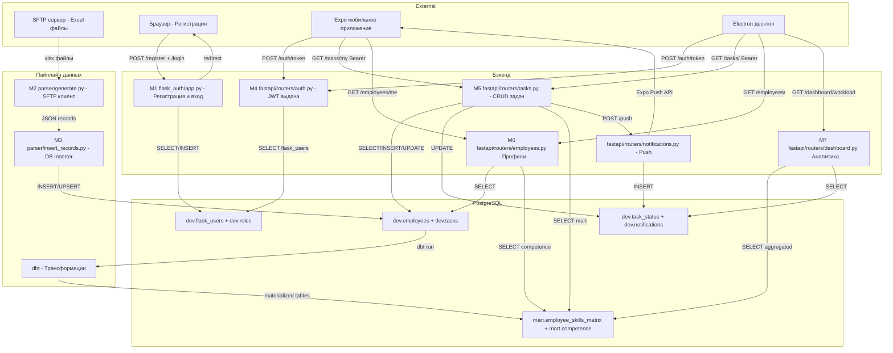
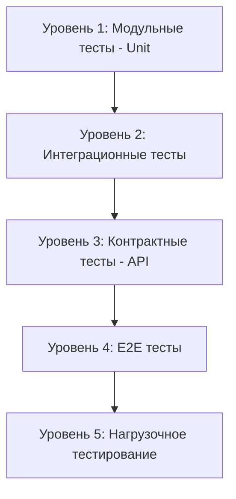
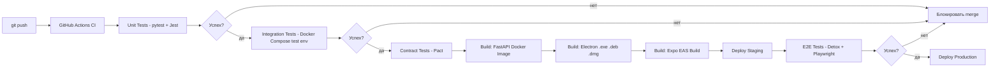

# Стратегия тестирования: Skill Matrix — Программный комплекс управления задачами

## Содержание

1. [Обзор программного кода модулей](#1-обзор-программного-кода-модулей)
2. [Графы потока управления и цикломатические числа](#2-графы-потока-управления-и-цикломатические-числа)
3. [Тестовые случаи по графам](#3-тестовые-случаи-по-графам)
4. [Модульное тестирование](#4-модульное-тестирование)
5. [Схема взаимодействия модулей](#5-схема-взаимодействия-модулей)
6. [Стратегия тестирования взаимодействия модулей](#6-стратегия-тестирования-взаимодействия-модулей)

---

## 1. Обзор программного кода модулей

Система состоит из **6 функциональных группп модулей**:

### 1.1 Существующие модули

#### M1 — `flask_auth/app.py` — Веб-авторизация
**Назначение:** Регистрация пользователей через браузер, проверка учётных данных, выдача JWT.

**Ключевые функции:**

| Функция | Описание | Входные данные | Выходные данные |
|---------|---------|---------------|----------------|
| `connect_db()` | Создаёт соединение с PostgreSQL | — | `psycopg2.connection` |
| `get_user_data(username)` | Получает хэш пароля и employee_id по имени | `str` username | `dict` или `None` |
| `insert_user_data(username, employee_id, password)` | Регистрирует нового пользователя | 3 строки | `(bool, str|None)` |
| `login()` | Обрабатывает GET/POST форму входа | HTTP request | Redirect или HTML |
| `register()` | Обрабатывает форму регистрации | HTTP request | Redirect или HTML |

**Зависимости:** `psycopg2`, `bcrypt`, `jwt`, `Flask`

---

#### M2 — `parser/generate.py` — Парсер Excel
**Назначение:** Загрузка Excel-файлов сотрудников и задач с удалённого SFTP-сервера.

**Ключевые функции:**

| Функция | Описание | Входные данные | Выходные данные |
|---------|---------|---------------|----------------|
| `get_excel_data_from_server(ip, user, pwd)` | SSH/SFTP соединение, чтение xlsx | credentials | `dict{employees, tasks}` |
| `data()` | Загружает env-переменные и вызывает get_excel | — | `dict{employees, tasks}` |

**Зависимости:** `paramiko`, `pandas`, `openpyxl`, `python-dotenv`

---

#### M3 — `parser/insert_records.py` — Загрузчик в БД
**Назначение:** Вставка/обновление записей из JSON в таблицы `dev.employees` и `dev.tasks`.

**Ключевые функции:**

| Функция | Описание |
|---------|---------|
| `main()` | Оркестрирует весь цикл: get data → upsert employees → upsert tasks |
| `upsert_employees(conn, records)` | INSERT ... ON CONFLICT UPDATE для сотрудников |
| `upsert_tasks(conn, records)` | INSERT ... ON CONFLICT UPDATE для задач |

---

### 1.2 Новые модули (FastAPI)

#### M4 — `fastapi_app/routers/auth.py` — JWT аутентификация API
**Назначение:** Проверка логина/пароля из БД, генерация access + refresh JWT токенов.

```python
# Псевдокод модуля auth.py
async def login(form_data: OAuth2PasswordRequestForm):
    user = await get_user_from_db(form_data.username)
    if not user:
        raise HTTPException(401, "User not found")
    if not bcrypt.checkpw(form_data.password, user.password_hash):
        raise HTTPException(401, "Wrong password")
    access_token = create_jwt(user.username, user.role, expires=30min)
    refresh_token = create_jwt(user.username, user.role, expires=7days)
    return {"access_token": access_token, "refresh_token": refresh_token}

async def get_current_user(token: str = Depends(oauth2_scheme)):
    try:
        payload = jwt.decode(token, SECRET_KEY)
        username = payload.get("sub")
        if not username:
            raise credentials_exception
        return payload
    except JWTError:
        raise credentials_exception
```

---

#### M5 — `fastapi_app/routers/tasks.py` — CRUD задач
**Назначение:** Получение, создание, изменение статуса задач с учётом ролей.

```python
# Псевдокод ключевых функций
async def get_my_tasks(current_user: dict = Depends(get_current_user)):
    employee_id = current_user["employee_id"]
    return await db.fetch_all(
        "SELECT * FROM mart.employee_skills_matrix WHERE employee_id = :id",
        {"id": employee_id}
    )

async def create_task(task: TaskCreate, current_user = Depends(require_role("manager"))):
    if task.deadline < datetime.now():
        raise HTTPException(400, "Deadline in the past")
    task_id = await db.execute(INSERT INTO dev.tasks ...)
    await notify_assigned_employee(task.assigned_employee_id, task_id)
    return {"task_id": task_id}

async def update_task_status(task_id: str, status: TaskStatus,
                              current_user = Depends(get_current_user)):
    task = await get_task_or_404(task_id)
    if current_user["role"] == "employee" and task.assigned_id != current_user["employee_id"]:
        raise HTTPException(403, "Not your task")
    await db.execute(UPDATE dev.task_status SET status = :s WHERE task_id = :id, ...)
    return {"ok": True}
```

---

#### M6 — `fastapi_app/routers/employees.py` — Профили и компетенции
**Назначение:** Получение профиля сотрудника, обновление уровней компетенций.

```python
async def get_my_profile(current_user = Depends(get_current_user)):
    employee_id = current_user["employee_id"]
    profile = await db.fetch_one("SELECT * FROM dev.employees WHERE employee_id = :id", ...)
    competencies = await db.fetch_all("SELECT * FROM mart.competence WHERE employee_id = :id", ...)
    return {"profile": profile, "competencies": competencies}

async def update_competencies(employee_id: str, competencies: list[CompetencyUpdate],
                               current_user = Depends(require_role("hr"))):
    for comp in competencies:
        await db.execute(
            INSERT INTO dev.employee_competency_level ... ON CONFLICT UPDATE ...
        )
    return {"updated": len(competencies)}
```

---

#### M7 — `fastapi_app/routers/dashboard.py` — Аналитика для руководителей
**Назначение:** Агрегированные данные о загруженности, skills-gap, рисках отпусков.

```python
async def get_workload(dept: str = None, current_user = Depends(require_role("manager"))):
    query = """
        SELECT employee_id, employee_full_name, COUNT(task_id) as task_count,
               SUM(CASE WHEN status='in_progress' THEN 1 ELSE 0 END) as active_tasks
        FROM mart.employee_skills_matrix esm
        JOIN dev.task_status ts ON esm.task_id = ts.task_id
        WHERE (:dept IS NULL OR esm.employee_department = :dept)
        GROUP BY employee_id, employee_full_name
    """
    return await db.fetch_all(query, {"dept": dept})

async def get_skills_gap(current_user = Depends(require_role("manager"))):
    # Задачи без подходящего исполнителя (position_match = FALSE)
    return await db.fetch_all(
        "SELECT * FROM mart.employee_skills_matrix WHERE position_match = FALSE"
    )
```

---

#### M8 — Мобильное приложение Expo — `hooks/useTasks.ts`
**Назначение:** React Query хук для получения и мутации задач с кэшированием.

```typescript
// Псевдокод
export function useTasks() {
  const { token } = useAuthStore();

  const query = useQuery({
    queryKey: ['tasks', 'my'],
    queryFn: () => api.get('/tasks/my', { headers: { Authorization: `Bearer ${token}` } }),
    staleTime: 5 * 60 * 1000,   // кэш 5 минут
    retry: (count, error) => {
      if (error.status === 401) return false;  // не повторять при 401
      return count < 3;
    }
  });

  const updateStatus = useMutation({
    mutationFn: ({ taskId, status }) =>
      api.put(`/tasks/${taskId}/status`, { status }),
    onSuccess: () => queryClient.invalidateQueries(['tasks'])
  });

  return { tasks: query.data, isLoading: query.isLoading, updateStatus };
}
```

---

#### M9 — Десктоп Electron — `src/components/AssignmentSuggest.tsx`
**Назначение:** Алгоритм подбора исполнителя по компетенциям задачи.

```typescript
// Псевдокод алгоритма подбора
function suggestAssignees(task: Task, employees: Employee[]): SuggestedEmployee[] {
  return employees
    .filter(emp => {
      const positionMatch = emp.position === task.required_position;
      const competencyMatch = emp.competencies.some(c =>
        c.name === task.required_competency && c.level >= MINIMUM_LEVEL
      );
      const notOnVacation = !isOnVacation(emp, task.deadline);
      const notOverloaded = emp.active_tasks < MAX_TASKS_THRESHOLD;
      return positionMatch && competencyMatch && notOnVacation && notOverloaded;
    })
    .sort((a, b) => a.active_tasks - b.active_tasks)  // сначала менее загруженные
    .slice(0, 5);  // топ-5 кандидатов
}
```

---

## 2. Графы потока управления и цикломатические числа

> Цикломатическая сложность: **V(G) = E - N + 2P**, где E — рёбра, N — узлы, P — компоненты связности (обычно 1).
> Также: **V(G) = количество замкнутых областей + 1** = **количество условных предикатов + 1**.

---

### 2.1 Модуль M1 — `get_user_data(username)`

```
[1] Начало
 ↓
[2] try: connect_db()
 ↓
[3] cur.execute(SELECT ...)
 ↓
[4] result = cur.fetchone()
 ↓
[5] result is not None? ──── ДА ──→ [6] return dict{password_hash, username, employee_id}
 ↓ НЕТ                                      ↓
[7] return None                           [КОНЕЦ]
 ↓                             ↑
[КОНЕЦ]                        │
 ↑                             │
[8] except Exception ──────────┘→ [9] print(error) → [10] return None
```

**Узлы (N):** 10  
**Рёбра (E):** 11  
**V(G) = 11 - 10 + 2 = 3**

**Независимые пути:**
- Путь 1: `1→2→3→4→5(да)→6→конец` — успешный возврат данных
- Путь 2: `1→2→3→4→5(нет)→7→конец` — пользователь не найден
- Путь 3: `1→2(исключение)→8→9→10→конец` — ошибка БД

---

### 2.2 Модуль M1 — `insert_user_data(username, employee_id, password)`

```
[1] Начало
 ↓
[2] bcrypt.hashpw(password)
 ↓
[3] try: connect_db()
 ↓
[4] cur.execute(INSERT ...)
 ↓
[5] conn.commit()
 ↓
[6] return (True, None)
 ↓
[КОНЕЦ]
 ↑
[7] except UniqueViolation ──→ [8] return (False, "User already exists")
 ↑
[9] except Exception ─────────→ [10] print(error) → [11] return (False, str(e))
```

**Узлы (N):** 11  
**Рёбра (E):** 13  
**V(G) = 13 - 11 + 2 = 4**

**Независимые пути:**
- Путь 1: `1→2→3→4→5→6→конец` — успешная регистрация
- Путь 2: `1→2→3→4(UniqueViolation)→7→8→конец` — дублирующийся пользователь
- Путь 3: `1→2→3(Exception)→9→10→11→конец` — ошибка подключения к БД
- Путь 4: `1→2→3→4(Exception)→9→10→11→конец` — ошибка вставки

---

### 2.3 Модуль M4 — `login()` (FastAPI auth)

```
[1] Начало: form_data поступает
 ↓
[2] user = await get_user_from_db(username)
 ↓
[3] user существует? ──── НЕТ ──→ [4] raise HTTPException(401, "not found") → [КОНЕЦ]
 ↓ ДА
[5] bcrypt.checkpw(password, hash)
 ↓
[6] пароль верен? ──── НЕТ ──→ [7] raise HTTPException(401, "wrong pwd") → [КОНЕЦ]
 ↓ ДА
[8] user.is_active? ──── НЕТ ──→ [9] raise HTTPException(403, "inactive") → [КОНЕЦ]
 ↓ ДА
[10] create_jwt(access_token)
 ↓
[11] create_jwt(refresh_token)
 ↓
[12] return {access_token, refresh_token, role}
 ↓
[КОНЕЦ]
```

**Узлы (N):** 12  
**Рёбра (E):** 14  
**V(G) = 14 - 12 + 2 = 4**

**Независимые пути:**
- Путь 1: `1→2→3(да)→5→6(да)→8(да)→10→11→12→конец` — успешный вход
- Путь 2: `1→2→3(нет)→4→конец` — пользователь не найден
- Путь 3: `1→2→3(да)→5→6(нет)→7→конец` — неверный пароль
- Путь 4: `1→2→3(да)→5→6(да)→8(нет)→9→конец` — пользователь заблокирован

---

### 2.4 Модуль M5 — `update_task_status()`

```
[1] Начало
 ↓
[2] task = await get_task_or_404(task_id)
 ↓
[3] task найдена? ──── НЕТ ──→ [4] raise HTTPException(404) → [КОНЕЦ]
 ↓ ДА
[5] role == "employee"?
 ↓ ДА                  ↓ НЕТ
[6] task.assigned_id == employee_id?    [10] Переходим к обновлению
 ↓ НЕТ        ↓ ДА
[7] raise     [8] (разрешено)
 HTTPException(403)  ↓
 ↓           [9] db.execute UPDATE task_status
[КОНЕЦ]       ↓
             [10] return {"ok": True}
              ↓
             [КОНЕЦ]
```

**Узлы (N):** 10  
**Рёбра (E):** 12  
**V(G) = 12 - 10 + 2 = 4**

**Независимые пути:**
- Путь 1: `1→2→3(да)→5(нет)→10→конец` — manager/hr меняет любой статус
- Путь 2: `1→2→3(да)→5(да)→6(да)→8→9→10→конец` — сотрудник меняет свою задачу
- Путь 3: `1→2→3(да)→5(да)→6(нет)→7→конец` — сотрудник пытается изменить чужую задачу
- Путь 4: `1→2→3(нет)→4→конец` — задача не найдена

---

### 2.5 Модуль M9 — `suggestAssignees()`

```
[1] Начало: task, employees[]
 ↓
[2] Для каждого сотрудника emp в employees:
 ↓
[3] positionMatch = emp.position == task.required_position
 ↓
[4] positionMatch? ──── НЕТ ──→ [пропустить]
 ↓ ДА
[5] competencyMatch = emp.competencies.some(c.name == req && c.level >= MIN)
 ↓
[6] competencyMatch? ──── НЕТ ──→ [пропустить]
 ↓ ДА
[7] notOnVacation = !isOnVacation(emp, deadline)
 ↓
[8] notOnVacation? ──── НЕТ ──→ [пропустить]
 ↓ ДА
[9] notOverloaded = emp.active_tasks < MAX_TASKS
 ↓
[10] notOverloaded? ──── НЕТ ──→ [пропустить]
 ↓ ДА
[11] добавить в результат
 ↓
[12] отсортировать по active_tasks
 ↓
[13] вернуть топ-5
 ↓
[КОНЕЦ]
```

**Предикаты:** 4 условия (positionMatch, competencyMatch, notOnVacation, notOverloaded)  
**V(G) = 4 + 1 = 5**

**Независимые пути:**
- Путь 1: `все условия TRUE` — сотрудник попадает в список
- Путь 2: `positionMatch = FALSE` — отсев по должности
- Путь 3: `competencyMatch = FALSE` — отсев по компетенции
- Путь 4: `notOnVacation = FALSE` — сотрудник в отпуске
- Путь 5: `notOverloaded = FALSE` — сотрудник перегружен

---

### 2.6 Сводная таблица цикломатических чисел

| Модуль | Функция | V(G) | Риск |
|--------|---------|------|------|
| M1 Flask | `get_user_data()` | **3** | Низкий |
| M1 Flask | `insert_user_data()` | **4** | Низкий |
| M4 FastAPI | `login()` | **4** | Низкий |
| M5 FastAPI | `update_task_status()` | **4** | Низкий |
| M7 FastAPI | `get_workload()` | **2** | Минимальный |
| M8 Expo | `useTasks()` retry logic | **3** | Низкий |
| M9 Electron | `suggestAssignees()` | **5** | Умеренный |

> **Интерпретация:** V(G) ≤ 5 — низкая сложность, хорошая тестируемость. V(G) 6-10 — умеренная. >10 — высокая, требует рефакторинга.

---

## 3. Тестовые случаи по графам

### 3.1 Тестовые случаи для `get_user_data()` (V(G) = 3)

| TC# | Путь | Входные данные | Ожидаемый результат |
|-----|------|---------------|-------------------|
| TC-GUD-01 | Путь 1 | `username = "ivanov"` (существует в БД) | `dict{"password_hash": "...", "username": "ivanov", "employee_id": "E001"}` |
| TC-GUD-02 | Путь 2 | `username = "nonexistent_user"` | `None` |
| TC-GUD-03 | Путь 3 | БД недоступна (mock ConnectionError) | `None`, вывод ошибки в `print` |

---

### 3.2 Тестовые случаи для `insert_user_data()` (V(G) = 4)

| TC# | Путь | Входные данные | Ожидаемый результат |
|-----|------|---------------|-------------------|
| TC-IUD-01 | Путь 1 | `username="petrov"`, `employee_id="E002"`, `password="Pass123!"` | `(True, None)` |
| TC-IUD-02 | Путь 2 | `username="ivanov"` (уже существует) | `(False, "User already exists or Employee ID is already registered")` |
| TC-IUD-03 | Путь 3 | БД недоступна | `(False, <строка с ошибкой>)` |
| TC-IUD-04 | Путь 4 | `employee_id` нарушает FK constraint | `(False, <строка с ошибкой>)` |

---

### 3.3 Тестовые случаи для `login()` FastAPI (V(G) = 4)

| TC# | Путь | Входные данные | HTTP статус | Ожидаемый результат |
|-----|------|---------------|------------|-------------------|
| TC-LGN-01 | Путь 1 | `username="ivanov"`, `password="correct"`, `is_active=True` | **200** | `{access_token, refresh_token, token_type, role}` |
| TC-LGN-02 | Путь 2 | `username="unknown"`, `password="any"` | **401** | `{"detail": "User not found"}` |
| TC-LGN-03 | Путь 3 | `username="ivanov"`, `password="wrong"` | **401** | `{"detail": "Wrong password"}` |
| TC-LGN-04 | Путь 4 | `username="blocked_user"`, `password="correct"`, `is_active=False` | **403** | `{"detail": "Account inactive"}` |

---

### 3.4 Тестовые случаи для `update_task_status()` (V(G) = 4)

| TC# | Путь | Роль / Данные | HTTP статус | Ожидаемый результат |
|-----|------|--------------|------------|-------------------|
| TC-UTS-01 | Путь 1 | `role="manager"`, любой `task_id` | **200** | `{"ok": True}` |
| TC-UTS-02 | Путь 2 | `role="employee"`, `task_id` назначен ему | **200** | `{"ok": True}` |
| TC-UTS-03 | Путь 3 | `role="employee"`, `task_id` чужой задачи | **403** | `{"detail": "Not your task"}` |
| TC-UTS-04 | Путь 4 | Любая роль, несуществующий `task_id` | **404** | `{"detail": "Task not found"}` |

---

### 3.5 Тестовые случаи для `suggestAssignees()` (V(G) = 5)

| TC# | Путь | Условие | Ожидаемый результат |
|-----|------|---------|-------------------|
| TC-SA-01 | Путь 1 | Сотрудник: position=match, competency=match, level≥2, не в отпуске, tasks<5 | Включён в список, отсортирован по tasks |
| TC-SA-02 | Путь 2 | Сотрудник: position≠required | Не включён |
| TC-SA-03 | Путь 3 | Position=match, но competency≠required | Не включён |
| TC-SA-04 | Путь 4 | Position+competency match, vacation_date пересекает deadline | Не включён |
| TC-SA-05 | Путь 5 | Все match, но active_tasks >= MAX_TASKS_THRESHOLD | Не включён |
| TC-SA-06 | Граничный | Ровно MAX_TASKS_THRESHOLD задач | Не включён (граничное условие) |
| TC-SA-07 | Граничный | Более 5 подходящих кандидатов | Возвращается ровно 5 |

---

## 4. Модульное тестирование

### 4.1 Стек инструментов

| Модуль | Инструмент | Библиотека |
|--------|----------|-----------|
| Flask `app.py` | `pytest` | `pytest`, `pytest-mock`, `psycopg2` |
| FastAPI | `pytest` + `httpx` | `pytest-asyncio`, `httpx`, `AsyncClient` |
| Expo / React Native | `Jest` + `@testing-library/react-native` | `jest`, `msw` (mock API) |
| Electron / React | `Jest` + `@testing-library/react` | `jest`, `@testing-library/user-event` |

---

### 4.2 Тесты для Flask `app.py` (pytest)

```python
# tests/test_flask_auth.py

import pytest
from unittest.mock import MagicMock, patch
from flask_auth.app import get_user_data, insert_user_data

class TestGetUserData:
    """TC-GUD-01, TC-GUD-02, TC-GUD-03"""

    @patch("flask_auth.app.connect_db")
    def test_existing_user_returns_dict(self, mock_db):
        # TC-GUD-01: Путь 1 — пользователь найден
        mock_conn = MagicMock()
        mock_cur = MagicMock()
        mock_cur.fetchone.return_value = ("hashed_pwd", "ivanov", "E001")
        mock_conn.cursor.return_value = mock_cur
        mock_db.return_value = mock_conn

        result = get_user_data("ivanov")

        assert result == {
            "password_hash": "hashed_pwd",
            "username": "ivanov",
            "employee_id": "E001"
        }

    @patch("flask_auth.app.connect_db")
    def test_nonexistent_user_returns_none(self, mock_db):
        # TC-GUD-02: Путь 2 — пользователь не найден
        mock_conn = MagicMock()
        mock_cur = MagicMock()
        mock_cur.fetchone.return_value = None
        mock_conn.cursor.return_value = mock_cur
        mock_db.return_value = mock_conn

        result = get_user_data("nonexistent")
        assert result is None

    @patch("flask_auth.app.connect_db", side_effect=Exception("Connection refused"))
    def test_db_error_returns_none(self, mock_db):
        # TC-GUD-03: Путь 3 — ошибка БД
        result = get_user_data("any_user")
        assert result is None


class TestInsertUserData:
    """TC-IUD-01 ... TC-IUD-04"""

    @patch("flask_auth.app.connect_db")
    @patch("flask_auth.app.bcrypt")
    def test_successful_registration(self, mock_bcrypt, mock_db):
        # TC-IUD-01: Путь 1 — успешная регистрация
        mock_bcrypt.hashpw.return_value = b"hashed"
        mock_bcrypt.gensalt.return_value = b"salt"
        mock_conn = MagicMock()
        mock_cur = MagicMock()
        mock_conn.cursor.return_value = mock_cur
        mock_db.return_value = mock_conn

        success, error = insert_user_data("petrov", "E002", "Pass123!")

        assert success is True
        assert error is None
        mock_conn.commit.assert_called_once()

    @patch("flask_auth.app.connect_db")
    @patch("flask_auth.app.bcrypt")
    def test_duplicate_user_raises_unique_violation(self, mock_bcrypt, mock_db):
        # TC-IUD-02: Путь 2 — дублирующийся пользователь
        import psycopg2
        mock_bcrypt.hashpw.return_value = b"hashed"
        mock_bcrypt.gensalt.return_value = b"salt"
        mock_conn = MagicMock()
        mock_cur = MagicMock()
        mock_cur.execute.side_effect = psycopg2.errors.UniqueViolation()
        mock_conn.cursor.return_value = mock_cur
        mock_db.return_value = mock_conn

        success, error = insert_user_data("ivanov", "E001", "Pass123!")

        assert success is False
        assert "already exists" in error

    @patch("flask_auth.app.connect_db", side_effect=Exception("DB down"))
    @patch("flask_auth.app.bcrypt")
    def test_db_connection_error(self, mock_bcrypt, mock_db):
        # TC-IUD-03: Путь 3 — ошибка подключения
        mock_bcrypt.hashpw.return_value = b"hashed"
        mock_bcrypt.gensalt.return_value = b"salt"

        success, error = insert_user_data("newuser", "E099", "Pass!")

        assert success is False
        assert error == "DB down"
```

---

### 4.3 Тесты для FastAPI (pytest-asyncio + httpx)

```python
# tests/test_fastapi_auth.py

import pytest
from httpx import AsyncClient, ASGITransport
from unittest.mock import AsyncMock, patch
from fastapi_app.main import app

@pytest.fixture
def anyio_backend():
    return "asyncio"

class TestAuthEndpoint:
    """TC-LGN-01 ... TC-LGN-04"""

    @pytest.mark.anyio
    async def test_successful_login(self):
        # TC-LGN-01: Путь 1 — успешный вход
        with patch("fastapi_app.routers.auth.get_user_from_db") as mock_get, \
             patch("fastapi_app.routers.auth.bcrypt.checkpw", return_value=True):
            mock_get.return_value = AsyncMock(
                username="ivanov",
                password_hash="$2b$...",
                employee_id="E001",
                role="employee",
                is_active=True
            )()
            async with AsyncClient(transport=ASGITransport(app=app), base_url="http://test") as client:
                resp = await client.post("/auth/token",
                    data={"username": "ivanov", "password": "correct"})
            assert resp.status_code == 200
            data = resp.json()
            assert "access_token" in data
            assert "refresh_token" in data
            assert data["role"] == "employee"

    @pytest.mark.anyio
    async def test_unknown_user_returns_401(self):
        # TC-LGN-02: Путь 2 — пользователь не найден
        with patch("fastapi_app.routers.auth.get_user_from_db", return_value=None):
            async with AsyncClient(transport=ASGITransport(app=app), base_url="http://test") as client:
                resp = await client.post("/auth/token",
                    data={"username": "unknown", "password": "any"})
        assert resp.status_code == 401
        assert resp.json()["detail"] == "User not found"

    @pytest.mark.anyio
    async def test_wrong_password_returns_401(self):
        # TC-LGN-03: Путь 3 — неверный пароль
        with patch("fastapi_app.routers.auth.get_user_from_db") as mock_get, \
             patch("fastapi_app.routers.auth.bcrypt.checkpw", return_value=False):
            mock_get.return_value = AsyncMock(
                password_hash="$2b$...", is_active=True)()
            async with AsyncClient(transport=ASGITransport(app=app), base_url="http://test") as client:
                resp = await client.post("/auth/token",
                    data={"username": "ivanov", "password": "wrong"})
        assert resp.status_code == 401

    @pytest.mark.anyio
    async def test_inactive_user_returns_403(self):
        # TC-LGN-04: Путь 4 — заблокированный аккаунт
        with patch("fastapi_app.routers.auth.get_user_from_db") as mock_get, \
             patch("fastapi_app.routers.auth.bcrypt.checkpw", return_value=True):
            mock_get.return_value = AsyncMock(
                password_hash="$2b$...", is_active=False)()
            async with AsyncClient(transport=ASGITransport(app=app), base_url="http://test") as client:
                resp = await client.post("/auth/token",
                    data={"username": "blocked", "password": "correct"})
        assert resp.status_code == 403


class TestTaskStatusEndpoint:
    """TC-UTS-01 ... TC-UTS-04"""

    @pytest.mark.anyio
    async def test_manager_can_update_any_task(self):
        # TC-UTS-01: manager меняет любую задачу
        manager_token = create_test_jwt(role="manager", employee_id="M001")
        with patch("fastapi_app.routers.tasks.get_task_or_404") as mock_task, \
             patch("fastapi_app.routers.tasks.db.execute", new_callable=AsyncMock):
            mock_task.return_value = MagicMock(assigned_employee_id="E001")
            async with AsyncClient(transport=ASGITransport(app=app), base_url="http://test") as client:
                resp = await client.put("/tasks/TASK001/status",
                    json={"status": "done"},
                    headers={"Authorization": f"Bearer {manager_token}"})
        assert resp.status_code == 200
        assert resp.json()["ok"] is True

    @pytest.mark.anyio
    async def test_employee_cannot_update_others_task(self):
        # TC-UTS-03: сотрудник пытается изменить чужую задачу
        emp_token = create_test_jwt(role="employee", employee_id="E002")
        with patch("fastapi_app.routers.tasks.get_task_or_404") as mock_task:
            mock_task.return_value = MagicMock(assigned_employee_id="E001")  # чужая задача
            async with AsyncClient(transport=ASGITransport(app=app), base_url="http://test") as client:
                resp = await client.put("/tasks/TASK001/status",
                    json={"status": "done"},
                    headers={"Authorization": f"Bearer {emp_token}"})
        assert resp.status_code == 403
```

---

### 4.4 Тесты для Expo (Jest + React Testing Library)

```typescript
// mobile-app/__tests__/suggestAssignees.test.ts

import { suggestAssignees } from '../src/utils/assignmentSuggest';

const mockTask = {
  required_position: 'Developer',
  required_competency: 'Python',
  deadline: new Date('2026-06-01')
};

describe('suggestAssignees - TC-SA-*', () => {
  test('TC-SA-01: включает подходящего сотрудника', () => {
    const employees = [{
      employee_id: 'E001',
      position: 'Developer',
      competencies: [{ name: 'Python', level: 2 }],
      planned_vacation_date: null,
      active_tasks: 2
    }];
    const result = suggestAssignees(mockTask, employees);
    expect(result).toHaveLength(1);
    expect(result[0].employee_id).toBe('E001');
  });

  test('TC-SA-02: исключает при несовпадении должности', () => {
    const employees = [{
      employee_id: 'E002',
      position: 'Designer',  // не совпадает
      competencies: [{ name: 'Python', level: 3 }],
      planned_vacation_date: null,
      active_tasks: 1
    }];
    expect(suggestAssignees(mockTask, employees)).toHaveLength(0);
  });

  test('TC-SA-03: исключает при отсутствии нужной компетенции', () => {
    const employees = [{
      employee_id: 'E003',
      position: 'Developer',
      competencies: [{ name: 'Java', level: 3 }],  // не та компетенция
      planned_vacation_date: null,
      active_tasks: 1
    }];
    expect(suggestAssignees(mockTask, employees)).toHaveLength(0);
  });

  test('TC-SA-04: исключает при пересечении с отпуском', () => {
    const employees = [{
      employee_id: 'E004',
      position: 'Developer',
      competencies: [{ name: 'Python', level: 2 }],
      planned_vacation_date: new Date('2026-05-20'),  // до дедлайна
      active_tasks: 1
    }];
    expect(suggestAssignees(mockTask, employees)).toHaveLength(0);
  });

  test('TC-SA-05: исключает перегруженного сотрудника', () => {
    const employees = [{
      employee_id: 'E005',
      position: 'Developer',
      competencies: [{ name: 'Python', level: 2 }],
      planned_vacation_date: null,
      active_tasks: 10  // выше MAX_TASKS_THRESHOLD=5
    }];
    expect(suggestAssignees(mockTask, employees)).toHaveLength(0);
  });

  test('TC-SA-07: возвращает максимум 5 кандидатов', () => {
    const employees = Array.from({ length: 10 }, (_, i) => ({
      employee_id: `E00${i}`,
      position: 'Developer',
      competencies: [{ name: 'Python', level: 2 }],
      planned_vacation_date: null,
      active_tasks: i
    }));
    const result = suggestAssignees(mockTask, employees);
    expect(result).toHaveLength(5);
    // Убеждаемся, что отсортированы по загруженности
    expect(result[0].active_tasks).toBeLessThanOrEqual(result[1].active_tasks);
  });
});
```

---

## 5. Схема взаимодействия модулей



### 5.1 Матрица зависимостей модулей

| Модуль | Зависит от | Используется в |
|--------|-----------|---------------|
| M1 `flask_auth` | PostgreSQL `dev.flask_users` | Браузер (регистрация) |
| M2 `parser/generate` | SFTP сервер | M3 `insert_records` |
| M3 `insert_records` | M2, PostgreSQL `dev.*` | Airflow DAG |
| dbt models | PostgreSQL `dev.*` | Airflow DAG |
| M4 `fastapi/auth` | PostgreSQL `dev.flask_users`, `dev.roles` | M5, M6, M7, Expo, Electron |
| M5 `fastapi/tasks` | M4 (auth), mart, `dev.task_status` | Expo, Electron |
| M6 `fastapi/employees` | M4 (auth), `dev.employees`, mart | Expo, Electron |
| M7 `fastapi/dashboard` | M4 (auth), mart, `dev.task_status` | Electron |
| M8 Expo `useTasks` | M4, M5 через HTTP | Expo экраны |
| M9 Electron `suggestAssignees` | M6, M5 данные из API | Electron TaskCreate |

---

## 6. Стратегия тестирования взаимодействия модулей

### 6.1 Уровни тестирования



---

### 6.2 Интеграционные тесты (Уровень 2)

#### IT-01: Парсер → БД → dbt (пайплайн данных)

```python
# tests/integration/test_pipeline.py

@pytest.mark.integration
def test_excel_to_mart_pipeline(test_db, mock_sftp_server):
    """
    Проверяет полный цикл: Excel → insert_records → dbt run → mart
    """
    # 1. Загрузить тестовый xlsx через mock SFTP
    from parser.insert_records import main
    main()

    # 2. Проверить наличие записей в dev.employees
    with test_db.cursor() as cur:
        cur.execute("SELECT COUNT(*) FROM dev.employees")
        assert cur.fetchone()[0] > 0

    # 3. Запустить dbt трансформации
    import subprocess
    result = subprocess.run(["dbt", "run", "--select", "employee_skills_matrix"],
                             capture_output=True, cwd="dbt/my_matrix")
    assert result.returncode == 0

    # 4. Проверить mart-таблицу
    with test_db.cursor() as cur:
        cur.execute("SELECT COUNT(*) FROM mart.employee_skills_matrix")
        assert cur.fetchone()[0] > 0
```

#### IT-02: Flask Auth → FastAPI (цепочка аутентификации)

```python
# tests/integration/test_auth_chain.py

@pytest.mark.integration
@pytest.mark.anyio
async def test_register_then_login_to_api():
    """
    Пользователь регистрируется через Flask, затем входит через FastAPI
    """
    # 1. Регистрация через Flask
    async with AsyncClient(app=flask_app, base_url="http://flask") as flask_client:
        resp = await flask_client.post("/register", data={
            "username": "test_integration",
            "employee_id": "E_INT_01",
            "password": "TestPass123!"
        })
        assert resp.status_code in [200, 302]

    # 2. Вход через FastAPI
    async with AsyncClient(app=fastapi_app, base_url="http://api") as api_client:
        resp = await api_client.post("/auth/token", data={
            "username": "test_integration",
            "password": "TestPass123!"
        })
        assert resp.status_code == 200
        token = resp.json()["access_token"]

    # 3. Получение профиля с токеном
    async with AsyncClient(app=fastapi_app, base_url="http://api") as api_client:
        resp = await api_client.get("/employees/me",
            headers={"Authorization": f"Bearer {token}"})
        assert resp.status_code == 200
        assert resp.json()["employee_id"] == "E_INT_01"
```

#### IT-03: FastAPI Tasks → Уведомления (создание задачи)

```python
# tests/integration/test_task_notification.py

@pytest.mark.integration
@pytest.mark.anyio
async def test_create_task_triggers_notification():
    """
    При создании задачи с назначенным исполнителем создаётся уведомление
    """
    manager_token = create_test_jwt(role="manager", employee_id="M001")

    async with AsyncClient(app=fastapi_app, base_url="http://api") as client:
        resp = await client.post("/tasks/", json={
            "task_name": "Интеграционный тест",
            "department": "IT",
            "required_position": "Developer",
            "required_competency": "Python",
            "deadline": "2026-12-01",
            "assigned_employee_id": "E001"
        }, headers={"Authorization": f"Bearer {manager_token}"})

        assert resp.status_code == 201
        task_id = resp.json()["task_id"]

    # Проверить, что уведомление создано в БД
    async with AsyncClient(app=fastapi_app, base_url="http://api") as client:
        employee_token = create_test_jwt(role="employee", employee_id="E001")
        notif_resp = await client.get("/notifications/",
            headers={"Authorization": f"Bearer {employee_token}"})
        notifications = notif_resp.json()
        assert any(n["task_id"] == task_id for n in notifications)
```

---

### 6.3 Контрактные тесты API (Уровень 3)

Используется **Pact** (consumer-driven contract testing) для проверки совместимости мобильного клиента и FastAPI.

```python
# tests/contract/test_mobile_api_contract.py

# Consumer (Expo) определяет ожидаемый контракт:
EXPECTED_TASK_RESPONSE = {
    "task_id": str,
    "task_name": str,
    "status": str,            # "new" | "in_progress" | "done" | "blocked"
    "priority": int,
    "deadline": str,          # ISO 8601
    "required_competency": str,
    "assigned_employee_id": (str, type(None))
}

@pytest.mark.contract
@pytest.mark.anyio
async def test_get_my_tasks_contract():
    """Проверяет, что FastAPI возвращает структуру, ожидаемую мобильным клиентом"""
    token = create_test_jwt(role="employee", employee_id="E001")
    async with AsyncClient(app=fastapi_app, base_url="http://api") as client:
        resp = await client.get("/tasks/my",
            headers={"Authorization": f"Bearer {token}"})

    assert resp.status_code == 200
    tasks = resp.json()
    assert isinstance(tasks, list)
    if tasks:
        task = tasks[0]
        for field, expected_type in EXPECTED_TASK_RESPONSE.items():
            assert field in task, f"Поле '{field}' отсутствует в ответе"
            if not isinstance(expected_type, tuple):
                assert isinstance(task[field], expected_type), \
                    f"Поле '{field}' имеет тип {type(task[field])}, ожидался {expected_type}"
```

---

### 6.4 E2E тесты (Уровень 4)

#### E2E-01: Полный пользовательский сценарий (Expo)

```typescript
// mobile-app/e2e/taskFlow.e2e.ts (Detox)

describe('Полный сценарий сотрудника', () => {
  beforeAll(async () => {
    await device.launchApp();
  });

  it('E2E-01: Вход → просмотр задач → изменение статуса', async () => {
    // Шаг 1: Вход
    await element(by.id('input-username')).typeText('ivanov');
    await element(by.id('input-password')).typeText('Pass123!');
    await element(by.id('btn-login')).tap();
    await waitFor(element(by.id('screen-tasks'))).toBeVisible().withTimeout(5000);

    // Шаг 2: Проверка списка задач
    await expect(element(by.id('task-list'))).toBeVisible();
    await element(by.id('task-item-0')).tap();

    // Шаг 3: Открытие задачи
    await waitFor(element(by.id('screen-task-detail'))).toBeVisible().withTimeout(3000);
    await expect(element(by.id('task-status-badge'))).toBeVisible();

    // Шаг 4: Изменение статуса
    await element(by.id('btn-change-status')).tap();
    await element(by.id('status-option-in_progress')).tap();
    await waitFor(element(by.text('Статус обновлён'))).toBeVisible().withTimeout(3000);
  });

  it('E2E-02: Просмотр профиля и матрицы компетенций', async () => {
    await element(by.id('tab-profile')).tap();
    await waitFor(element(by.id('screen-profile'))).toBeVisible().withTimeout(3000);
    await expect(element(by.id('competency-chart'))).toBeVisible();
  });
});
```

#### E2E-02: Полный сценарий менеджера (Electron — Playwright)

```typescript
// desktop-app/e2e/managerFlow.spec.ts (Playwright)

import { test, expect, ElectronApplication, Page } from '@playwright/test';

test.describe('Сценарий менеджера', () => {
  let electronApp: ElectronApplication;
  let page: Page;

  test.beforeAll(async ({ playwright }) => {
    electronApp = await playwright._electron.launch({ args: ['dist/main.js'] });
    page = await electronApp.firstWindow();
  });

  test('E2E-03: Вход → дашборд → создание задачи с подбором исполнителя', async () => {
    // Вход
    await page.fill('[data-testid="input-username"]', 'manager_petrov');
    await page.fill('[data-testid="input-password"]', 'ManagerPass!');
    await page.click('[data-testid="btn-login"]');
    await page.waitForSelector('[data-testid="dashboard-workload"]');

    // Проверить тепловую карту
    await expect(page.locator('[data-testid="workload-heatmap"]')).toBeVisible();

    // Создать задачу
    await page.click('[data-testid="btn-create-task"]');
    await page.fill('[data-testid="input-task-name"]', 'Тестовая задача E2E');
    await page.selectOption('[data-testid="select-required-position"]', 'Developer');
    await page.selectOption('[data-testid="select-competency"]', 'Python');

    // Подбор исполнителя
    await page.click('[data-testid="btn-suggest-assignees"]');
    await page.waitForSelector('[data-testid="suggested-list"]');
    const suggestions = page.locator('[data-testid="suggestion-item"]');
    await expect(suggestions).toHaveCountGreaterThan(0);

    // Назначить первого кандидата
    await suggestions.first().click();
    await page.click('[data-testid="btn-submit-task"]');
    await page.waitForSelector('[data-testid="toast-task-created"]');
    await expect(page.locator('[data-testid="toast-task-created"]')).toBeVisible();
  });
});
```

---

### 6.5 Нагрузочное тестирование (Уровень 5)

**Инструмент:** `locust` для FastAPI

```python
# tests/load/locustfile.py

from locust import HttpUser, task, between

class SkillMatrixUser(HttpUser):
    wait_time = between(1, 3)
    token = None

    def on_start(self):
        """Авторизация перед тестом"""
        resp = self.client.post("/auth/token", data={
            "username": "load_test_user",
            "password": "LoadTest123!"
        })
        self.token = resp.json().get("access_token")

    @task(5)
    def get_my_tasks(self):
        """Наиболее частый запрос — 5x вес"""
        self.client.get("/tasks/my",
            headers={"Authorization": f"Bearer {self.token}"})

    @task(3)
    def get_profile(self):
        self.client.get("/employees/me",
            headers={"Authorization": f"Bearer {self.token}"})

    @task(2)
    def get_notifications(self):
        self.client.get("/notifications/",
            headers={"Authorization": f"Bearer {self.token}"})

    @task(1)
    def get_workload_dashboard(self):
        """Редкий тяжёлый запрос — 1x вес"""
        self.client.get("/dashboard/workload",
            headers={"Authorization": f"Bearer {self.token}"})
```

**Целевые показатели нагрузочного тестирования:**

| Метрика | Цель | Критический предел |
|---------|------|-------------------|
| RPS (запросов/сек) | ≥ 200 | < 100 — провал |
| Медианное время ответа `/tasks/my` | ≤ 200 мс | > 1000 мс — провал |
| 95-й перцентиль `/dashboard/workload` | ≤ 800 мс | > 3000 мс — провал |
| Процент ошибок (5xx) | ≤ 0.1% | > 1% — провал |
| Одновременных пользователей | 500 | — |

---

### 6.6 Тестовая среда и CI/CD пайплайн



**Конфигурация `pytest.ini`:**

```ini
[pytest]
markers =
    unit: Модульные тесты (быстрые, без внешних зависимостей)
    integration: Интеграционные тесты (требуют БД)
    contract: Контрактные тесты API
    e2e: End-to-end тесты
    load: Нагрузочные тесты

testpaths = tests
asyncio_mode = auto
```

**Запуск тестов по уровням:**

```bash
# Только модульные (быстро, для pre-commit)
pytest -m unit

# Интеграционные (с тестовой БД в Docker)
pytest -m integration --docker-compose=docker-compose.test.yaml

# Все тесты кроме нагрузочных
pytest -m "not load"

# Нагрузочные
locust -f tests/load/locustfile.py --host=http://localhost:8001 --users 500 --spawn-rate 10
```

---

### 6.7 Покрытие кода (Code Coverage)

**Цели по покрытию:**

| Модуль | Минимальное покрытие |
|--------|---------------------|
| `fastapi_app/routers/auth.py` | ≥ 90% |
| `fastapi_app/routers/tasks.py` | ≥ 85% |
| `fastapi_app/routers/employees.py` | ≥ 85% |
| `fastapi_app/routers/dashboard.py` | ≥ 80% |
| `flask_auth/app.py` | ≥ 85% |
| `parser/insert_records.py` | ≥ 80% |
| Expo `hooks/useTasks.ts` | ≥ 75% |
| Electron `utils/assignmentSuggest.ts` | ≥ 90% |

```bash
# Запуск с отчётом покрытия
pytest --cov=fastapi_app --cov=flask_auth --cov=parser \
       --cov-report=html --cov-report=term-missing \
       --cov-fail-under=80
```
